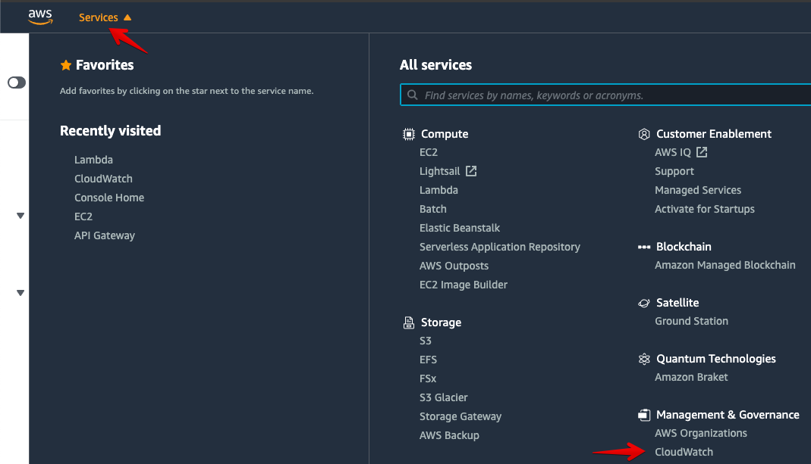

# Initial run of Splunk Mobile Phone Shop Application 

!!! important "Required information"
    **You should have the following information at hand as you will need this in various places throughout the workshop**

    - Access to the AWS account that is used to setup the workshop. 
    - The region the Workshop is using to run the workshop (f.e. Ireland, Frankfurt,
      Ohio, Tokio ..)
    - A Preset allowing you to identify your services etc.
    - IP address & password of the EC2 instances assigned to you.

---
## 1. Validate availability of Lambda Functions
Please log into the AWS account that has been used to create the workshop and select the region that is used by the workshop.

{: .zoom}

Once the Lambda service have been selected you should see a list of available Lambda Functions.  To find the ones that are assigned to you, use the filter option, to see only the ones for you - **ACME** in our example
You should have:

 - RetailOrder_**Preset**
 - RetailOrderLine_**Preset**
 - RetailOrderPrice_**Preset**
 - RetailOrderDiscount_**Preset**

(Replace **Preset** with the text you have been provided)
{: .zoom}

---
## 2. Verify CloudWatch logs location

To verify issues that may occur during the run, we need to check the CloudWatch logs.Please open or clone a second Browser window to AWS. The service to select is CloudWatch this time.

{: .zoom}

The activity to pick in CloudWatch is the Log Group  section.
 
{: .zoom}

if there logs present you can again filter on your preset. the result should be that there no logs visible. (if there are, even after filtering on your preset, make sure they are not be related to the 4 service above)

{: .zoom}

---
## 3. Connect to your EC2 instance
Next open a Terminal window and log into your EC2 instance you have been assigned.
If you need help with this, you can check (link to ssh info) how to proceed. 

cd into SplunkLambdaAPM/LocalmbdaCallers/JavaLambdaBAse
run:
   mvn spring-boot:run
   (losts of initial downloading)

(screenshot)
  .   ____          _            __ _ _
 /\\ / ___'_ __ _ _(_)_ __  __ _ \ \ \ \
( ( )\___ | '_ | '_| | '_ \/ _` | \ \ \ \
 \\/  ___)| |_)| | | | | || (_| |  ) ) ) )
  '  |____| .__|_| |_|_| |_\__, | / / / /
 =========|_|==============|___/=/_/_/_/
 :: Spring Boot ::        (v2.3.4.RELEASE)

2020-11-26 13:08:04.819  INFO [ACME-Mobile-Web-Shop-Base,,,] 4819 --- [           main] com.sfx.JavaLambda.StartWebApplication   : No active profile set, falling back to default profiles: default
2020-11-26 13:08:05.625  INFO [ACME-Mobile-Web-Shop-Base,,,] 4819 --- [           main] o.s.cloud.context.scope.GenericScope     : BeanFactory id=a4b02033-d795-30be-9748-cfa08498933d
2020-11-26 13:08:06.249  INFO [ACME-Mobile-Web-Shop-Base,,,] 4819 --- [           main] o.s.b.w.embedded.tomcat.TomcatWebServer  : Tomcat initialized with port(s): 8080 (http)
2020-11-26 13:08:06.260  INFO [ACME-Mobile-Web-Shop-Base,,,] 4819 --- [           main] o.apache.catalina.core.StandardService   : Starting service [Tomcat]
2020-11-26 13:08:06.261  INFO [ACME-Mobile-Web-Shop-Base,,,] 4819 --- [           main] org.apache.catalina.core.StandardEngine  : Starting Servlet engine: [Apache Tomcat/9.0.38]
2020-11-26 13:08:06.373  INFO [ACME-Mobile-Web-Shop-Base,,,] 4819 --- [           main] o.a.c.c.C.[Tomcat].[localhost].[/]       : Initializing Spring embedded WebApplicationContext
2020-11-26 13:08:06.374  INFO [ACME-Mobile-Web-Shop-Base,,,] 4819 --- [           main] w.s.c.ServletWebServerApplicationContext : Root WebApplicationContext: initialization completed in 1529 ms
2020-11-26 13:08:07.108  INFO [ACME-Mobile-Web-Shop-Base,,,] 4819 --- [           main] o.s.s.concurrent.ThreadPoolTaskExecutor  : Initializing ExecutorService 'applicationTaskExecutor'
2020-11-26 13:08:07.617  INFO [ACME-Mobile-Web-Shop-Base,,,] 4819 --- [           main] o.s.b.w.embedded.tomcat.TomcatWebServer  : Tomcat started on port(s): 8080 (http) with context path ''
2020-11-26 13:08:07.639  INFO [ACME-Mobile-Web-Shop-Base,,,] 4819 --- [           main] com.sfx.JavaLambda.StartWebApplication   : Started StartWebApplication in 3.837 seconds (JVM running for 4.356)

---
## 4. Test the Splunk mobile phone shop app

open a new browser tab and surf to  http://[ec2_ip]:8080/order

screen shot

type - name of a phone F.E. Geoff's big pictures Phone
     - Quantity  > 1
     - select a customer type

      hit submit

    screens shot both output spring and result in browser
---
## 4. Verify logs in Cloudwatch
go to cloudwatch and check if all four logs have been generated

Success on to ENable apm

