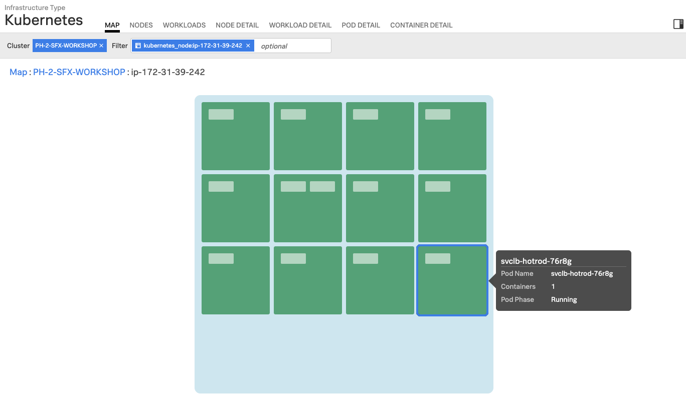
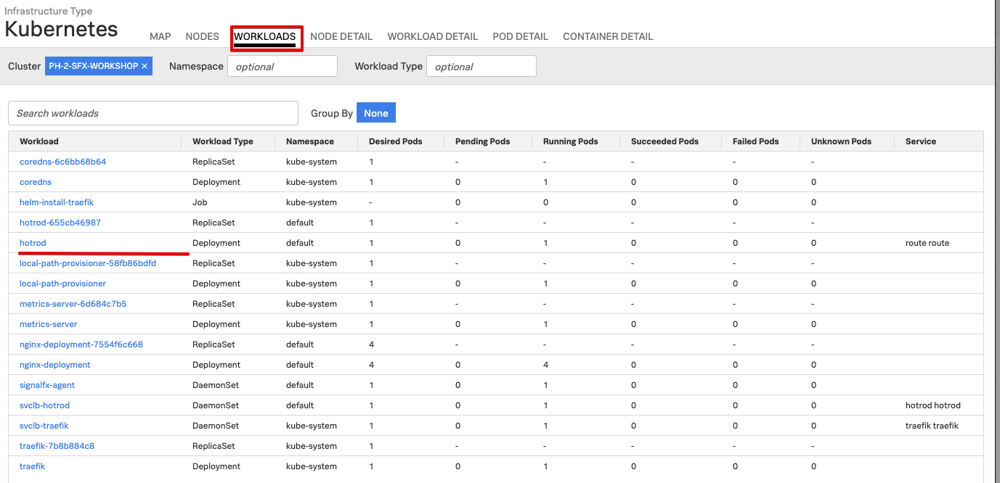
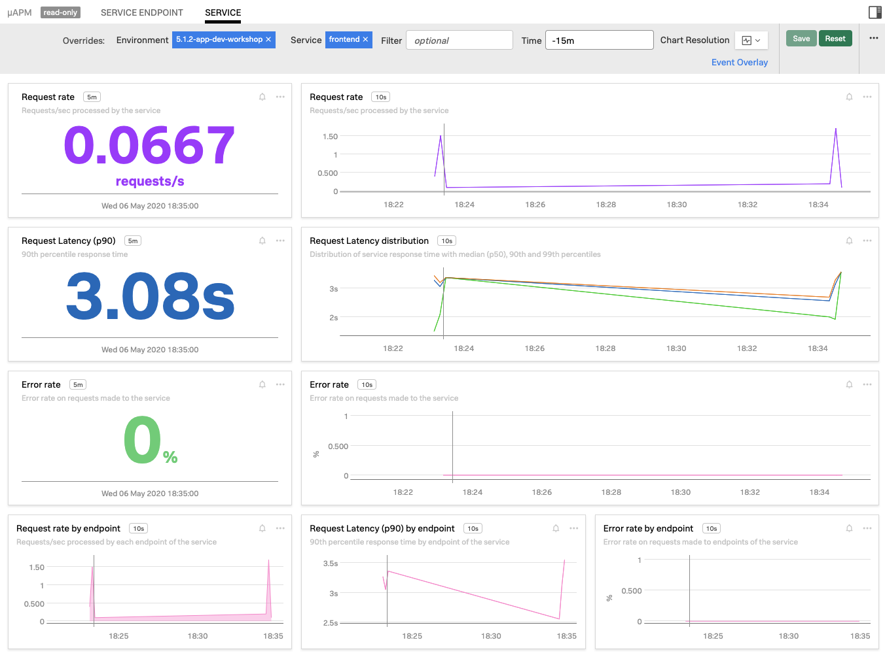
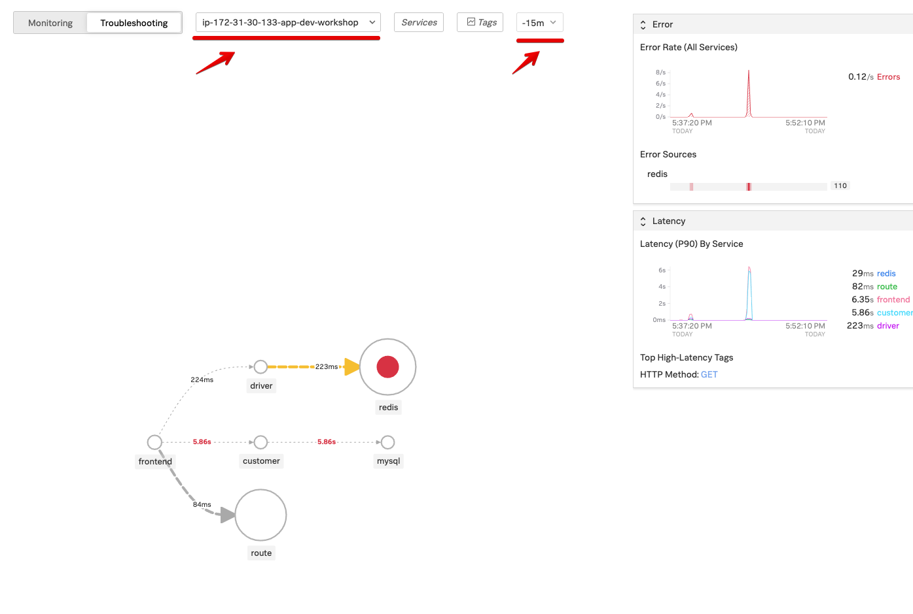

# Deploying Hot R.O.D. in K3s - Lab Summary

* Deploy the Hot R.O.D. application into Kubernetes (K3s)
* Verify the application is running
* Generate some artificial traffic
* See APM data in the UI

!!! warning "Ensure you have a running instance"
    The setup part is already documented in the [Preparation](../../smartagent/prep/) and [Deploy the Smart Agent in K3s](../../smartagent/k3s/) steps.

    If you are using an AWS/EC2 instance, make sure it is available and skip to [Step 1](../../apm/hotrod/#1-deploy-the-hot-rod-application-into-k3s), otherwise ensure your Multipass instance is available and running before continuing.

    === "Shell Command"

        ```
        multipass list
        ```

    === "Example Output"

        ```
        Name                     State             IPv4             Image
        vmpe-k3s                 Running           192.168.64.17    Ubuntu 18.04 LTS
        ```

---

## 1. Deploy the Hot R.O.D. application into K3s

To deploy the Hot R.O.D. application into K3s apply the deployment.
  
=== "Shell Command"

    ```text
    cd ~/workshop
    sudo kubectl apply -f apm/hotrod/k8s/deployment.yaml 
    ```

=== "Output"

    ```text
    deployment.apps/hotrod created
    service/hotrod created
    ```

To ensure the Hot R.O.D. application is running:

=== "Shell Command"

    ```text
    sudo kubectl get pods
    ```

=== "Example Output"

    ```text
    NAME                      READY   STATUS    RESTARTS   AGE
    signalfx-agent-mmzxk      1/1     Running   0          110s
    hotrod-7cc9fc85b7-n765r   1/1     Running   0          41s
    ```

---

## 2. Viewing the Hot R.O.D. application in your browser

!!! note "AWC/EC2 Users"
    If you are using an AWS/EC2 instance, the application will be available on port 8080 of the EC2 instance's IP address. Open your web browser and go to `http://{==EC2-IP==}:8080/`, you will then be able to see the application running.

    Then continue with the next section on how to [Generate Traffic](../../apm/hotrod/#3-generate-some-traffic-to-the-application-using-siege-benchmark).

In order to view the application in your web browser we need to find the `LoadBalancer` IP address and the port the application is listening on.

=== "Shell Command"

    ```text
    sudo kubectl get svc
    ```

=== "Example Output"

    ```text
    NAME         TYPE           CLUSTER-IP     EXTERNAL-IP     PORT(S)          AGE
    kubernetes   ClusterIP      10.43.0.1      <none>          443/TCP          43m
    hotrod       LoadBalancer   10.43.32.97   {==192.168.64.35==}   8080:31521/TCP   40m
    ```

Make note of the `EXTERNAL-IP` (in the example above this is `192.168.64.35`). Open your web browser and type in `http://{==EXTERNAL-IP==}:8080`, you will then be able to see the application running. Click on customer name to order a car:


---

## 3. Generate some traffic to the application using Siege Benchmark

Return to your shell and create an environment variable for the IP address and port that the Hot R.O.D. application is exposed on:

=== "Shell Command"

    ```
    HOTROD_ENDPOINT=$(sudo kubectl get svc hotrod -n default -o jsonpath='{.spec.clusterIP}:{.spec.ports[0].port}')
    ```

Confirm the environment variable is set

=== "Shell Command"

    ```
    curl $HOTROD_ENDPOINT
    ```

Then run the following command(s) to create load on the service:

=== "Shell Command"

    ```text
    siege -r2 -c20 "http://$HOTROD_ENDPOINT/dispatch?customer=392&nonse=0.17041229755366172"
    ```

Create some errors with an invalid customer number.

!!! note "Preparation"
    For a follow up lab, make note of the current time.

=== "Shell Command"

    ```text
    siege -r1 -c10 "http://$HOTROD_ENDPOINT/dispatch?customer=391&nonse=0.17041229755366172"
    ```

---

## 4. Validating the Hot R.O.D. application in Splunk Observability Suite

Open the SignalFx UI, and go to you cluster in the Kubernetes Navigator. You should see the new Pod being started and containers being deployed.

Usually it should only take around 20 seconds for the pod to transition into a Running state. When you click on the new pod in the SignalFx UI you should have a cluster that looks like below:

{: .zoom}

If you select the **WORKLOADS** tab again you should now see that there is a new replica set and a deployment added for hotrod:

{: .zoom}

Next, we want to validate that you are seeing the APM metrics in the UI.

For this we need to know the name of your application environment. In this workshop all the environments use your `{==hostname==}-apm-env`.

To find the hostname, check the prompt of you instance, please go to your instance (Multipass or AWS/EC2) and run the following command.

=== "Shell Command"

    ```text
    echo "Your APM environment is: $(hostname)-apm-env"
    ```

=== "Example Output"

    ```text
    Your APM environment is: ip-172-31-30-133-apm-env
    ```
---

Now go to **Dashboards → APM → Service**.  Please select your environment you found in the previous task then select the frontend service and set time to -15m ()

{: .zoom}

!!! warning  "No Data in charts"
    if no data is visible, check that you have the right service **frontend**, and not front-end.

To load the dashboard with more data run the following command a few times to create load on the service:

=== "Shell Command"

    ```text
    siege -r2 -c20 "http://$HOTROD_ENDPOINT/dispatch?customer=392&nonse=0.17041229755366172"
    ```

With this automatically generated dashboard you can keep an eye out for the health of your service, it provides various performance related charts as well as relevant information on the underlying host and Kubernetes platform if applicable.

Take some time to explore the various charts in this dashboard

---

## 5. Verify that APM traces are reaching SignalFx

Open SignalFx in your browser and select the **APM** tab.

{: .zoom}

Select the **Troubleshooting** tab, and select your environment you found before and set the time to 15 minutes. This will show you the automatically generated Dependency Map for the Hot R.O.D. application.
It should look similar to the screenshot below:

{: .zoom}

!!! warning
    If the screen looks very different you may by accident have selected the Previous Generation of APM (**APM PG**) from the menu bar.
    To rectify this, go back and select the **APM** tab.

The legend at the bottom of the page explains the different visualizations in the Dependency Map.

{: : .shadow .zoom}

* Service requests, error rate and root error rate.
* Request rate, latency and error rate

Also in this view you can see the overall Error and Latency rates over time charts.
