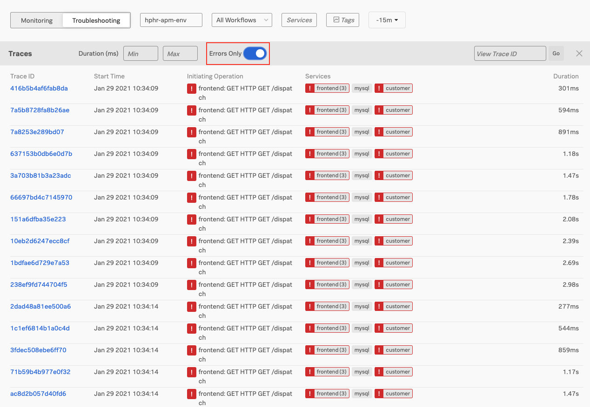

# uAPM troubleshooting - Hot R.O.D.- Lab Summary

* Explore troubleshooting and dependencies interface in uAPM
* Use the Breakdown feature to enrich the troubleshooting info
* Examine a trace in waterfall mode

!!! note "Ensure you have a running instance that has the hot R.O.D app running"
    The setup part is already documented in the [Preparation](../../smartagent/prep/), [Deploy the Smart Agent in K3s](../../smartagent/k3s/) and [Deploying hot-rod in K3s](../../apm/hotrod/) steps. If you are using an AWS/EC2 instance, make sure it is available and skip to [Step 1](../../apm/hotrod/#1-find-a-specific-trace-using-time-slots-andor-tags), otherwise ensure your Multipass instance is available and running before continuing.

    === "Input"

        ```
        multipass list
        ```

    === "Example Output"

        ```
        Name                     State             IPv4             Image
        vmpe-k3s                 Running           192.168.64.17    Ubuntu 18.04 LTS
        ```

---

## 1. Find a specific trace using time slots and/or tags

For this use case  we assume there is a problem reported with a clear time frame for an error.
This is the case when a customer reports problems, for example at 15:05 yesterday, or when a log reports an issue at an exact time.

Using the **All Traces** functionality, combined with using tags and/or services selections, we can find relevant traces, and dive into them to explore.

### 1.1 Select Application Environment

First, we need to know the name of your application environment.
In this workshop all the environments use your `{==hostname==}-apm-env`

To find the hostname, check the prompt of you instance, please go to your
instance (Multipass or EC2) and run the following command.

=== "Input"

    ```bash
    echo "Your µAPM environment is: $(hostname)-apm-env"
    ```

=== "Example Multipass Output"

    ```text
    Your µAPM environment is: vmpe-apm-env
    ```

=== "Example AWS/EC2 Output"

    ```text
    Your µAPM environment is: ip-172-31-30-133-apm-env

    ```

Open SignalFx in your browser and select the **µAPM** tab.

{: .zoom}

Select the **Troubleshooting** tab, and select your environment you found and set the time to 15 minutes. This will show you the automatically generated Dependency Map for the Hot R.O.D. application.
Please note the **Show Traces** button at the bottom of the page:

{: .zoom}

### 1.2 View traces in the Trace List

Now click  the **Show Traces** button at the bottom of the page.
this will start loading all the traces view, and if there are more then 25 it  will show a selection.
You can always hit the **Search all traces** link at the bottom of the page to fetch all traces for the time period.

{: .zoom}

In the scenario we are working with, the reported error that we are looking for is seen in the frontend service, when trying to call to the customer service to update customer details.

So the first activity for identifying the issue, is to pre-select both those services as a filter for the trace list.

This will just show the traces that have both these services in the trace.

### 1.3 Filtering traces in the Trace List

To do this, click on the services drop down at the top of the page and first select the **frontend** service. Then click on the  button to add a new line, then select the **customer** service.

{: .zoom}

On first review this step has not brought any visual changes, but there was a 3rd item we can use, we can filter on a specific time frame.

In the previous lab, you should have noted down a time, we are going to use that to filter the traces to that specific time slot.

### 1.4 Filtering traces in the Trace List

To do this, click on the duration drop down, (It should show -15m) and create a custom time slot.

You can set the current time by clicking on the little clock icon behind the time entry slot.

{: .zoom}

Make sure the time you noted down is in the range you set in the **FROM** and **TO** boxes. Keep the range as short as possible for the best result.
then hot the apply button to search for traces matching the filter in this time frame.

If you have set your time range correctly you should now see a change, an extra column appears called **Root Error**. indicating that the trace contains the original error.
{: .zoom}

To see the actual trace with the error, click on the blue linked TraceID in the **TraceID** column

This will bring you to the Trace Waterfall view, allowing you to inspect the trace in detail.

---

## 2. Examine traces in the waterfall view

---

## 3. Explore the troubleshooting and dependencies view

---

## 4. Use the breakdown feature to enrich troubleshooting info
