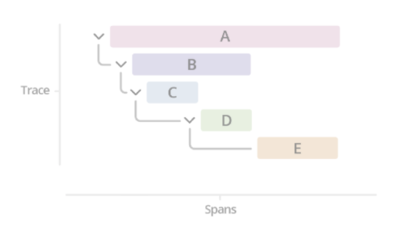
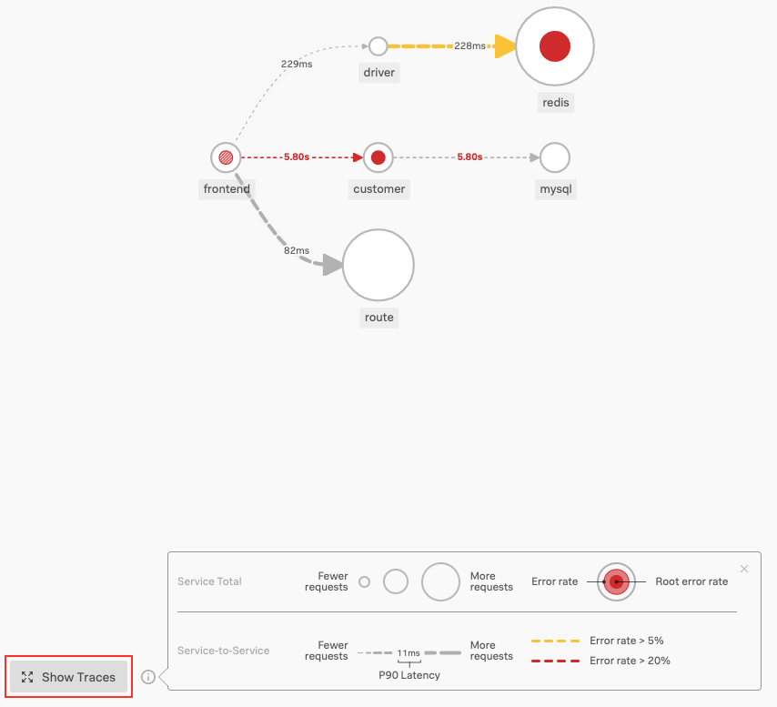
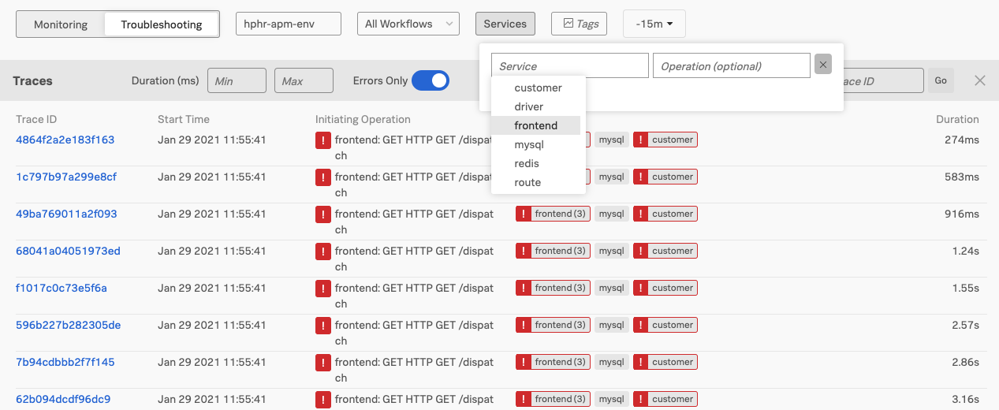
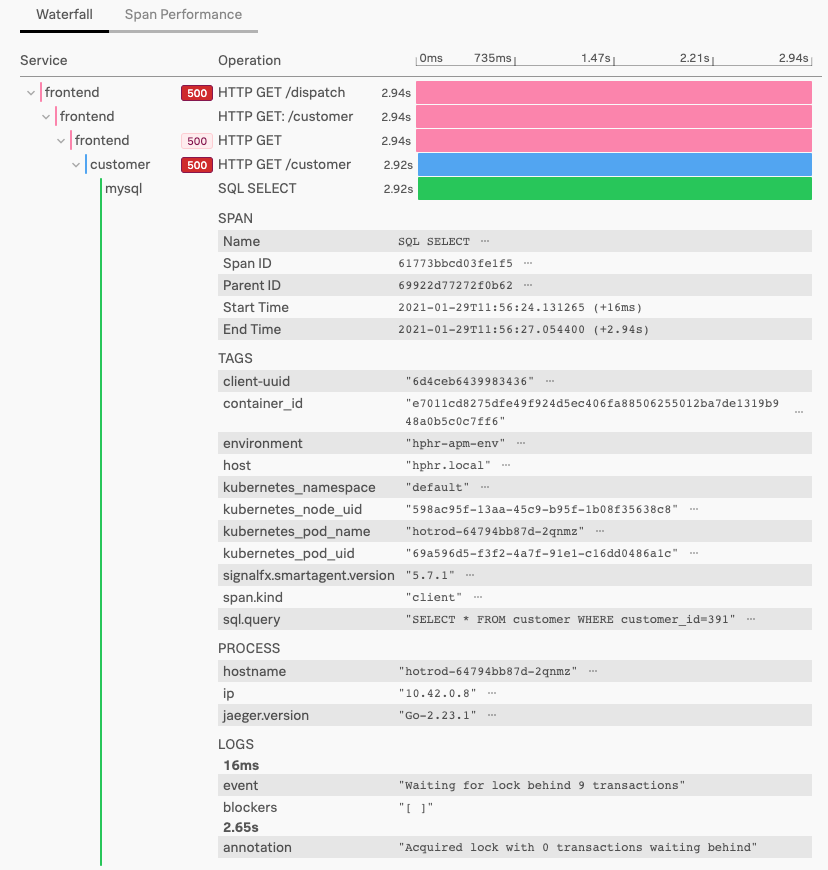
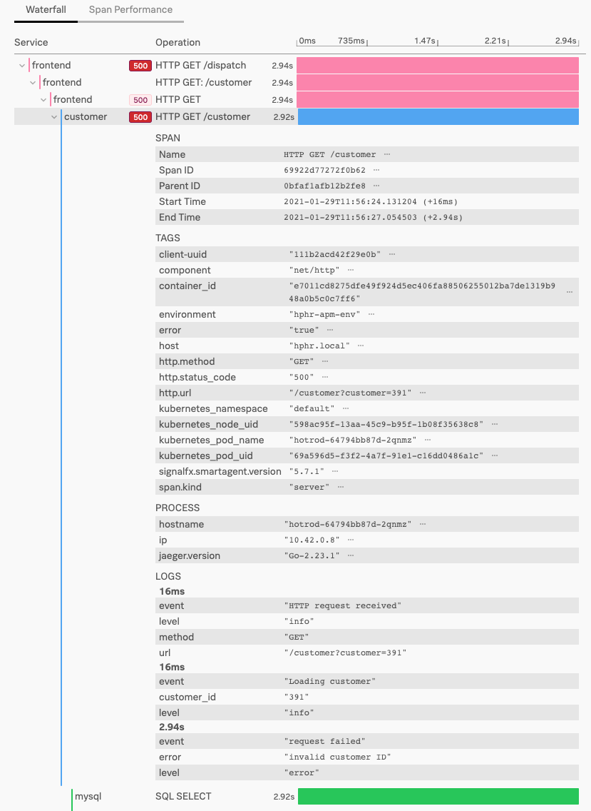

# Troubleshooting Hot R.O.D. - Lab Summary

* Find APM Traces for a specific time period or by service
* Examine traces in the waterfall
* Discover the cause of the errors

---

## 1. Traces and Spans explained

A trace is a collection of spans that share the same trace ID, representing a unique transaction handled by your application and its constituent services.

{: .zoom}

Each span has a name, representing the operation captured by this span, and a service name, representing within which service the operation took place.

Additionally, spans may reference another span as their parent, defining the relationships between the operations captured in the trace that were performed to process that transaction.

Each span contains a lot of information about the method, operation, or block of code that it captures, including:

* the operation name
* the start time of the operation with microsecond precision
* how long the operation took to execute, also with microsecond precision
* the logical name of the service on which the operation took place
* the IP address of the service instance on which the operation took place

## 2. Find a specific trace using time slots and/or tags

For this use case we assume there is a problem reported with a clear time frame for an error.

This is the case when a customer reports problems, for example at 15:05 yesterday, or when a log reports an issue at an exact time.

Using the **All Traces** functionality, combined with using tags and/or services selections, we can find relevant traces, and dive into them to explore.

### 2.1 Select Application Environment

First, we need to know the name of your application environment. In this workshop all the environments use your `{==hostname==}-apm-env`

To find the hostname, check the prompt of you instance, please go to your
instance and run the following command:

=== "Shell Command"

    ```text
    echo "Your APM environment is: $(hostname)-apm-env"
    ```

=== "Example AWS/EC2 Output"

    ```text
    Your APM environment is: whul-apm-env

    ```

Open SignalFx in your browser and select the **APM** tab.

{: .zoom}

Select the **Troubleshooting** tab, and select your environment you found and set the time to 15 minutes.

This will show you the automatically generated Dependency Map for the Hot R.O.D. application.

Please note the **Show Traces** button at the bottom of the page:

{: .zoom}

### 2.2 View traces in the Trace List

Now click  the **Show Traces** button at the bottom of the page.

This will start loading all the traces view, and if there are more then 25 it will show a selection.

You can always hit the **Search all traces** link at the bottom of the page to fetch all traces for the time period.

{: .zoom}

In the scenario we are working with, the reported error that we are looking for is seen in the frontend service, when trying to call to the customer service to update customer details.

So the first activity for identifying the issue, is to pre-select both those services as a filter for the trace list.

This will just show the traces that have both these services in the trace.

### 2.3 Filtering traces in the Trace List

To do this, click on the services drop down at the top of the page and first select the **frontend** service. Then click on the  button to add a new line, then select the **customer** service.

{: .zoom}

On first review this step has not brought any visual changes, but there was a 3rd item we can use, we can filter on a specific time frame.

In the previous lab, you should have noted down a time, we are going to use that to filter the traces to that specific time slot.

### 2.4 Filtering traces in the Trace List

To do this, click on the duration drop down, (It should show -15m) and create a custom time slot.

You can set the current time by clicking on the little clock icon behind the time entry slot.

{: .zoom}

Make sure the time you noted down is in the range you set in the **FROM** and **TO** boxes.

Keep the range as short as possible for the best result then hot the apply button to search for traces matching the filter in this time frame.

If you have set your time range correctly you should now see a change, an extra column appears called **Root Error**. indicating that the trace contains the original error.

{: .zoom}

To see the actual trace with the error, click on the blue linked TraceID in the **TraceID** column

This will bring you to the Trace Waterfall view, allowing you to inspect the trace in detail.

---

## 3. Examine traces in the waterfall view

You should now be in the Trace Waterfall view and your screen should like the view below:

{: .zoom}

The waterfall shows you the trace or route a request/interaction has taken though your application.

## 4. Exploring the waterfall view

As you can see from this trace, we have 3 front end spans, a customer span and a mysql span.

The top **frontend** service has a deep red icon , this indicates that this service has returned with an error.

The light red icon  on the last frontend span, indicates that the it has received an error from an underlying service.

The deep red icon  on the customer  service indicates that an error originates from that service.

Now lets explore the waterfall view.

First open the **mysql** span by clicking on the operation in the span label (SQL SELECT) to see what information is available in the tags that are part of this span.

{: .zoom}

The **TAGS** section will help you to identify or search further for specific problems.

There is information on your environment, your host and Kubernetes related information, you can use to validate the health of theses platforms.

You can also see information about the actual SQL query being performed.

In this case `"SELECT * FROM customer WHERE customer_id=391"`

Close the mysql span by clicking on the Operation in the span label again.

Now click on the **customer** span, this is the span with a deep red icon  and lets see if we can find the core of the problem.

This will open the span info and look like this:

{: .zoom}

You can see the various actions that are done by this service in the LOGS section.

It is trying to load customer 391, and as we can see the request failed due an invalid customer ID.

{: .zoom}
