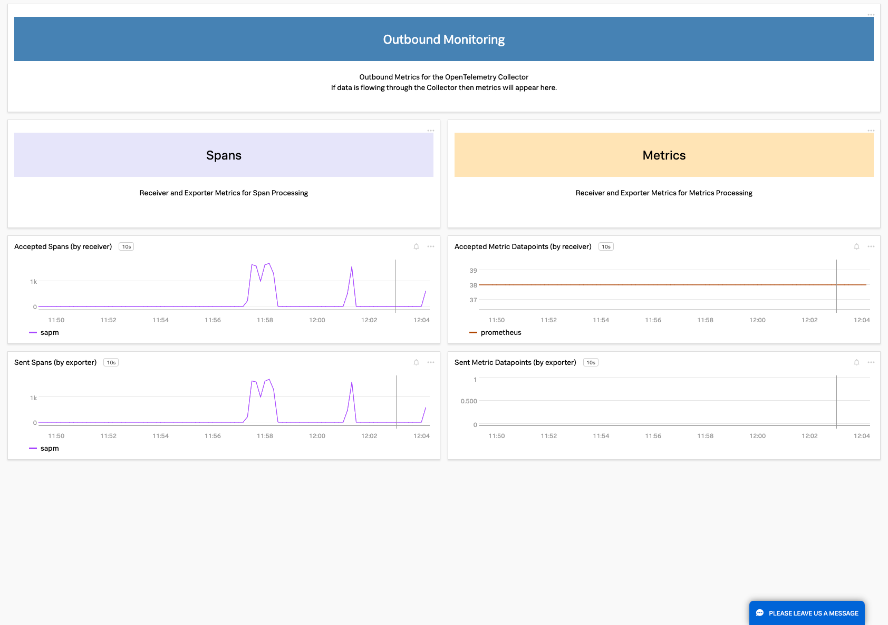

# Open Telemetry Collector

The collector is an optional component between the smart agent and SaaS ingest. In this configuration we are using the `sapm` endpoint to receive traces.

## 1. Install OpenTelemetry Collector with helm

Add the repository with

=== "Shell Command"
    ```
    helm repo add open-telemetry https://open-telemetry.github.io/opentelemetry-helm-charts
    ```

Then

=== "Shell Command"
    ```
    helm install \
    --set standaloneCollector.configOverride.exporters.signalfx.realm=$REALM \
    --set standaloneCollector.configOverride.exporters.signalfx.access_token=$ACCESS_TOKEN \
    --set standaloneCollector.configOverride.exporters.sapm.access_token=$ACCESS_TOKEN \
    --set standaloneCollector.configOverride.exporters.sapm.endpoint=https://ingest.$REALM.signalfx.com/v2/trace \
    opentelemetry-collector open-telemetry/opentelemetry-collector -f ~/workshop/otel/collector.yaml
    ```

## 2. Validate the OpenTelemetry Collector installation

=== "Shell Command"

Review the OpenTelemetry Collector logs:

```bash
sudo kubectl logs -l app.kubernetes.io/name=opentelemetry-collector
```

Look for a log entry with
=== "Example Output"

```text
... "msg":"Everything is ready. Begin running and processing data."}
```

Validate that the service is running and has a `sapm` endpoint on port 7276.

=== "Shell Command"

```
kubectl get svc opentelemetry-collector
```

=== "Example Output"

```
NAME                      TYPE        CLUSTER-IP      EXTERNAL-IP   PORT(S)                                           AGE
opentelemetry-collector   ClusterIP   10.43.119.140   <none>        14250/TCP,14268/TCP,55680/TCP,{==7276==}/TCP,9411/TCP   13m
```

Use the healthcheck endpoint to confirm:

=== "Shell Command"

```
OTEL_ENDPOINT=$(sudo kubectl get svc opentelemetry-collector -n default -o jsonpath='{.spec.clusterIP}')
curl http://$OTEL_ENDPOINT:13133/; echo
```

=== "Example Output"

```
{"status":"Server available","upSince":"2020-10-22T08:07:33.656859114Z","uptime":"8m33.548333561s"}
```

## 3. Reconfigure the agent to use OpenTelemetry Collector

We want to send traces in `sapm` format and point it to the OpenTelemetry Collector trace endpoint.


Uninstall the agent:

=== "Shell Command"

```
helm uninstall signalfx-agent
```

Then reinstall it with `traceEndpointUrl` set to point to OpenTelemetry Collector and using `sapm` as trace format:

=== "Shell Command"

```
helm install \
--set writer.traceExportFormat=sapm \
--set signalFxAccessToken=$ACCESS_TOKEN \
--set clusterName=$(hostname)-k3s-cluster \
--set kubeletAPI.url=https://localhost:10250 \
--set signalFxRealm=$REALM \
--set traceEndpointUrl=http://opentelemetry-collector:7276/v2/trace \
--set gatherDockerMetrics=false \
signalfx-agent signalfx/signalfx-agent \
-f ~/workshop/k3s/values.yaml
```

Check the OpenTelemetry Collector dashboards and validate metrics and spans are being sent.

{: .zoom}
