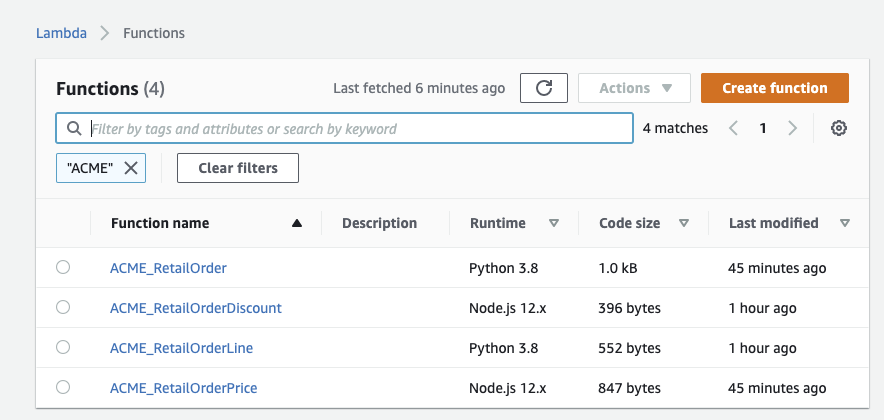
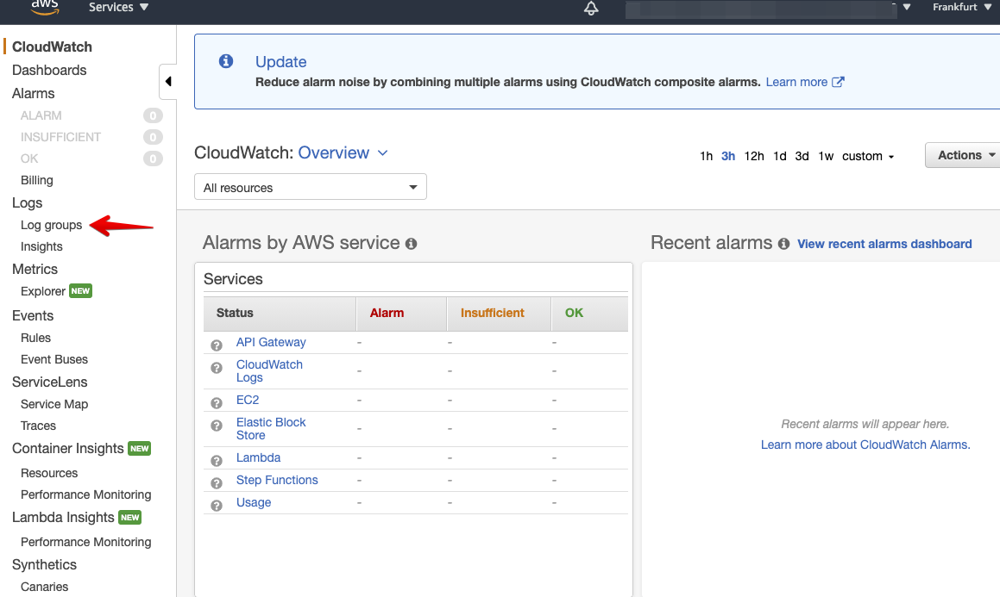
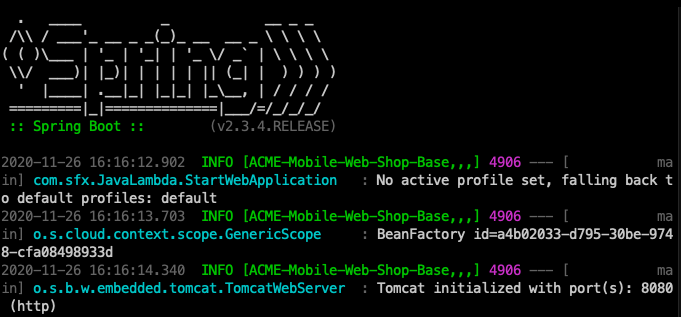
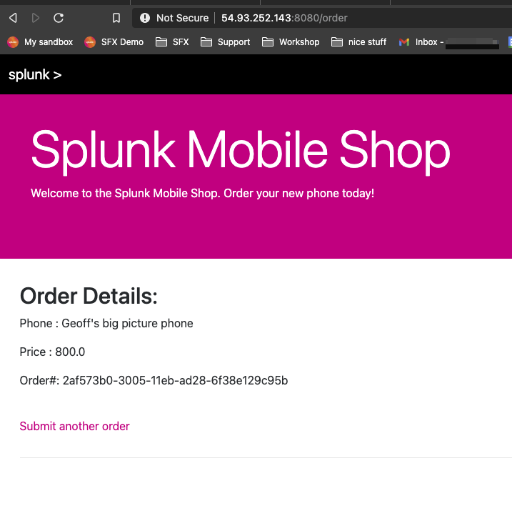
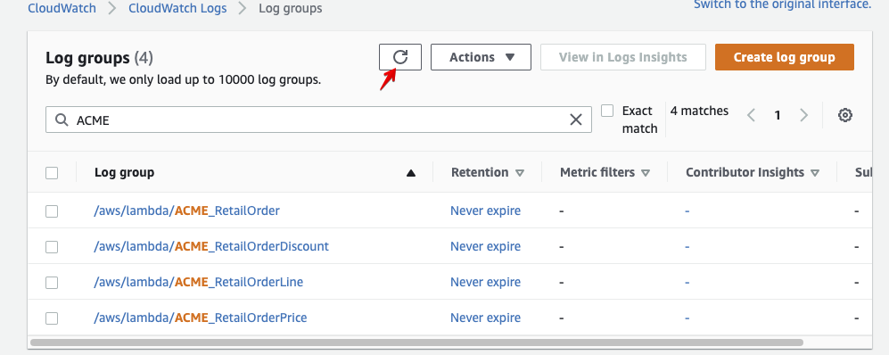

# Initial run of Splunk Mobile Phone Shop Application 

!!! important "Required information"
    **You should have the following information at hand as you will need this in various places throughout the workshop**

    - Access to the AWS account that is used to setup the workshop. 
    - The region the Workshop is using to run the workshop (f.e. Ireland, Frankfurt,
      Ohio, Tokio ..)
    - A Preset allowing you to identify your services etc.
    - IP address & password of the EC2 instances assigned to you.

---
## 1. Validate availability of Lambda Functions
Please log into the AWS account that has been used to create the workshop and select the region that is used by the workshop.

{: .zoom}

Once the Lambda service have been selected you should see a list of available Lambda Functions.  To find the ones that are assigned to you, use the filter option with the the unique id you have been provided, to see only the ones for you, 
You should have:

 - **Preset**_RetailOrder
 - **Preset**_RetailOrderLine
 - **Preset**_RetailOrderPrice
 - **Preset**_RetailOrderDiscount

(Where **Preset**  represents the unique id you have been provided - **ACME** in our example)
{: .zoom}

---
## 2. Verify CloudWatch logs location

To verify issues that may occur during the run, we need to check the CloudWatch logs.
Please open or clone a second Browser window to the same AWS account. The service to select is CloudWatch this time.

{: .zoom}

The activity to pick in CloudWatch is the Log Group section.
 
{: .zoom}

If there logs present, you can filter on your preset like before. The result should be that there are no logs visible (see below). If there are logs, even after filtering on your preset, make sure they are not be related to the 4 service above, or delete them if possible)

{: .zoom}

---
## 3. Connect to your EC2 instance
Next open a Terminal window and log into your EC2 instance you have been assigned. 

( Note! for now double check you use the prefix_jc version).

If you need help with this, here are the instructions how to access you pre-configured [AWS/EC2 instance](../../../smartagent/connect-info/). Please return here after successfully connection to you instance.

Once connected move into the correct directory to run the Java SpringBoot application.
=== "Shell Command"

    ```text
    cd ~/SplunkLambdaAPM/LocalLambdaCallers/JavaLambdaBase
    ```

From here we will start the Java SpringBoot application that contains out simple web shop application.
Run the application by issuing the following command:

=== "Shell Command"

    ```text
    mvn spring-boot:run 
    ```
 

!!! info
    If you get the following error: 
    
    Command 'mvn' not found, but can be installed with:

    sudo apt install maven

    Maven has been updated and you can fix this by running the following commands:
   
    ```text
    sudo apt-get  update
    sudo apt-get install maven
    ```
    Please respond with Y to any prompt and try the mvn command again.
 

On the first run SpringBoot will download a lot of packages, be patience!

The next runs will be much faster.
{: .zoom}

but if everything is loaded you should see the SpringBoot logo.

{: .zoom}

We are now ready to test the app.

---
## 4. Test the Splunk mobile phone shop app

Please open a new browser tab and surf to  *http://**[ec2_ip]**:8080/order* (where **[ec2_ip]** is the ip address of the EC2 instance assigned to you)

{: .zoom}

To test your environment enter the following information:
    - Name of a phone: for example *Geoff's big pictures phone*
    - Quantity:  *2*
    - Select a customer type: *Silver*

And hit submit to run a test though your system.

The result should be similar to this :
{: .zoom} 
    
---
## 4. Verify logs in Cloudwatch

Even if there are no errors and you have the above result, check the Cloudwatch logs to verify they have been created.
Go to CloudWatch Browser tab hit the refresh button and check if all four logs have been generated.

{: .zoom} 

If this is correct we are now ready to add Traces and span's


