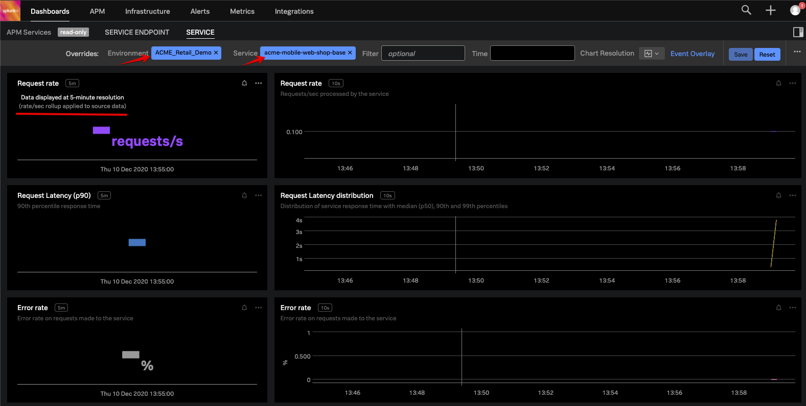

# Enable APM for On-prem Spring boot App (Cont.)
## 3. Run a case and find both the Service Dashboard and your trace 
Please go to the browser splunk mobile phone app or tab and surf to *http://**[ec2_ip]**:8080/order* (where **[ec2_ip]** is the ip address of the EC2 instance assigned to you)

{: .zoom}

You can run your first trace in  your environment by typing a phone name, a number greater then 0 and  pick a customer type:
    - Name of a phone: For example *Geoff's big pictures phone*
    - Quantity:  *2*
    - Select a customer type: *Silver*

And hit submit to fire off the first Trace.

The result should be similar to this :
{: .zoom} 

### 3.1 Find your Service Dashboard for the Springboot app in Splunk APM
Right now your trace is being processed by the splunk APM back end, and the service dashboard for the Springboot App will be generated.
Please find the browser tab with Splunk Infrastructure & APM or login to Splunk Infrastructure & APM. 

Hover over **Dashboards** in the top menu, and then click on **All Dashboards**. A number of prebuilt dashboards are provided for you in your default view.

{: .zoom} 

Here you should have a Dashboard Group called **APM Services** (If it is not present, wait for a minute or two and refresh the screen, If it has not appeared after two tries, reach out the the workshop leader)

Select the **Services** Dashboard.

{: .zoom} 

From the Environment Drop down box select ***Preset_*Retail_Demo**, from the Service drop down box select ***Preset_*-mobile-web-shop-base**.
{: .zoom} 

This wil give you the automatically generated service dashboard for ***Preset_*-mobile-web-shop-base**. 

If you set the time to -15 minutes you can see the single invocation, the averages over time will be filled in as well.
{: .zoom} 

If you can, open a new ssh terminal to the EC2 instance you have been assigned and log in.
From the prompt run the following command to add some load on you service.

=== "Shell Command"

    ```text
    siege -H 'Content-Type:application/json' /
     "http://localhost:8080/order POST &lt; ./test/test.json" -c 10 -r 10
    ```
The dashboard should now start to fill

## 3.1 Look at trace info in splunk APM
Please find the browser tab with Splunk infrastructure & APM  and select APM or login to Splunk Infrastructure & APM and select APM. 

{: .zoom}

At the APM monitoring page, Your service, If you see multiple, you can filter to you onw by , depending how many services you are currently monitoring with Splunk APM.

To verify your environment is clear, filter the environment by entering your unique id you have been provided

 