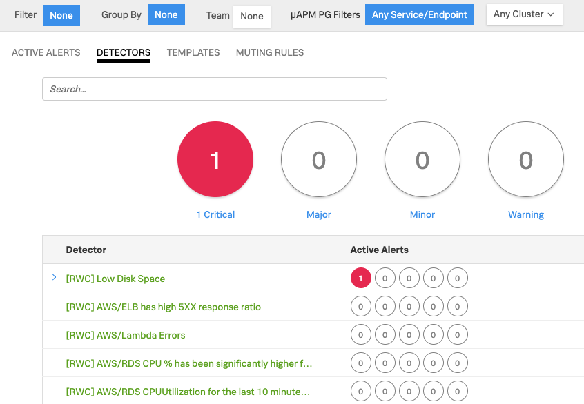

# Using Terraform - Lab Summary

* Initialize the SignalFx Provider.
* Run Terraform to create SignalFx detectors and dashboards from code using the SignalFx Terraform Provider.
* See how Terraform can also delete detectors and dashboards.

---

## 1. Initial setup

Remaining in your Multipass or AWS/EC2 instance from the **Smart Agent** module, change into the `signalfx-jumpstart` directory

=== "Input"

    ``` bash
    cd ~/signalfx-jumpstart
    ```

The environment variables needed should already be set from [Deploy the Smart Agent in K3s](../../smartagent/k3s/#2-use-helm-to-deploy-agent). If not, create the following environment variables to use in the Terraform steps below

=== "Input"

    ```
    export ACCESS_TOKEN=[ACCESS_TOKEN]
    export REALM=[REALM e.g. us1]
    export INITIALS=[YOUR_INITIALS e.g. RWC]
    ```

Initialize Terraform and upgrade to the latest version of the SignalFx Terraform Provider

!!! note "Upgrading the SignalFx Terraform Provider"
    You will need to run this command each time a new version of the SignalFx Terraform Provider is released. You can track the releases on [GitHub](https://github.com/terraform-providers/terraform-provider-signalfx/releases).

=== "Input"

    ```bash
    terraform init -upgrade
    ```

=== "Output"

    ```
    Upgrading modules...
    - aws in modules/aws
    - azure in modules/azure
    - docker in modules/docker
    - gcp in modules/gcp
    - host in modules/host
    - kubernetes in modules/kubernetes
    - parent_child_dashboard in modules/dashboards/parent
    - pivotal in modules/pivotal
    - usage_dashboard in modules/dashboards/usage

    Initializing the backend...

    Initializing provider plugins...
    - Checking for available provider plugins...
    - Downloading plugin for provider "signalfx" (terraform-providers/signalfx) 4.18.6...

    The following providers do not have any version constraints in configuration,
    so the latest version was installed.

    To prevent automatic upgrades to new major versions that may contain breaking
    changes, it is recommended to add version = "..." constraints to the
    corresponding provider blocks in configuration, with the constraint strings
    suggested below.

    * provider.signalfx: version = "~> 4.18"

    Terraform has been successfully initialized!

    You may now begin working with Terraform. Try running "terraform plan" to see
    any changes that are required for your infrastructure. All Terraform commands
    should now work.

    If you ever set or change modules or backend configuration for Terraform,
    rerun this command to reinitialize your working directory. If you forget, other
    commands will detect it and remind you to do so if necessary.
    ```

Create a new workspace, replace `[WORKSPACE_NAME]` with what you want your workspace to be called:

=== "Input"

    ``` bash
    terraform workspace new [WORKSPACE_NAME]
    ```

=== "Output"

    ```text
    Created and switched to workspace "my_workspace"!

    You're now on a new, empty workspace. Workspaces isolate their state,
    so if you run "terraform plan" Terraform will not see any existing state
    for this configuration.
    ```

---

## 2. Create an execution plan

Review the execution plan.

=== "Input"

    ``` bash
    terraform plan -var="access_token=$ACCESS_TOKEN" -var="realm=$REALM" -var="sfx_prefix=$INITIALS"
    ```

If the plan executes successfully, we can go ahead and apply:

---

## 3. Apply actions from execution plan

=== "Input"

    ``` bash
    terraform apply -var="access_token=$ACCESS_TOKEN" -var="realm=$REALM" -var="sfx_prefix=$INITIALS"
    ```

Validate that the detectors were created, under the _**ALERTS → Detectors**_, you should see a list of new detectors with the a prefix of your initials:



---

## 4. Destroy all your hard work

You will first need to ensure you are in the correct workspace, replace `[WORKSPACE_NAME]` with the name created in the initial setup)

=== "Input"

    ```text
    terraform workspace select [WORKSPACE_NAME]
    ```

Destroy all Detectors and Dashboards that were previously applied.

!!! info

    The `var=”sfx_prefix=$INITIALS”` is not required!

=== "Input"

    ```bash
    terraform destroy -var="access_token=$ACCESS_TOKEN" -var="realm=$REALM"
    ```

Validate all the detectors have been removed by navigating to _**ALERTS → Detectors**_


