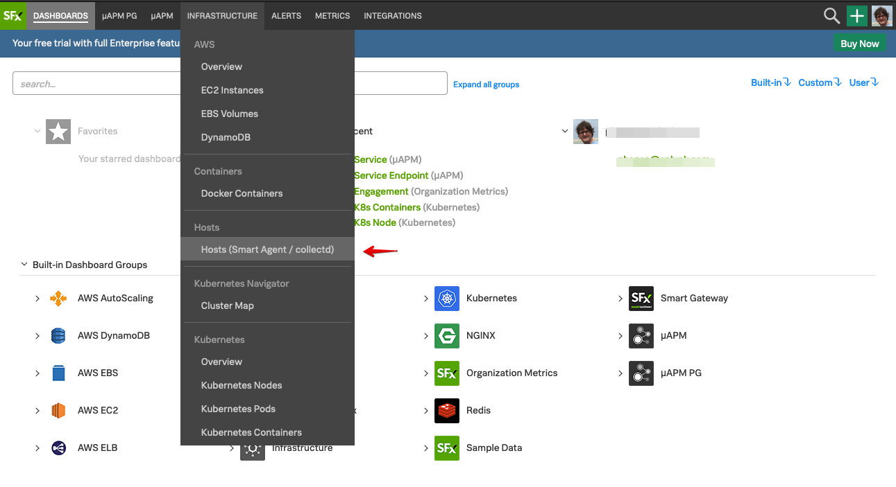
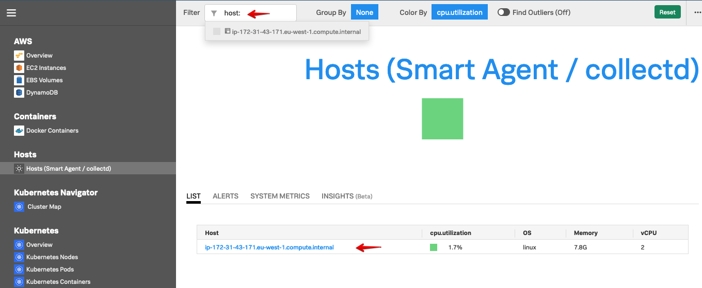
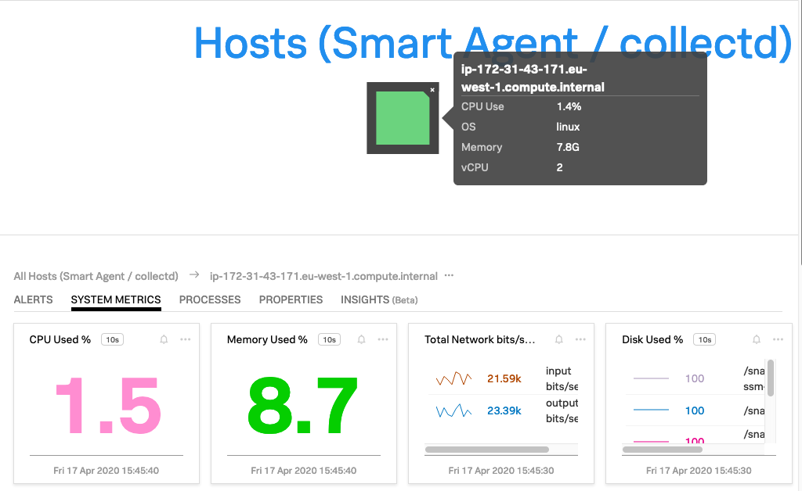

# Lab Summary

1. Deploy SignalFx Smart Agent via install script on a VM
2. Confirm the Smart Agent is working and sending data

---

Use `multipass` to create a vanilla Ubuntu VM and shell into it. You can also use a Linux-based VM with your cloud provider of choice. Replace `[INITIALS]` with your actual initials.

=== "Input"

    ```bash hl_lines="1 2"
    multipass launch [INITIALS]-vm
    multipass shell [INITIALs]-vm
    ```

## 1. Deploy SignalFx Smart Agent via install script on a VM

You will need to obtain your Access Token from the SignalFx UI. You can find your Access Token by clicking on your profile icon on the top right of the SignalFx UI. Then select _**Organization Settings → Access Tokens**_. Expand the Default token, then click on _**Show Token**_ to expose your token. Later in the lab you can come back here and click the _**Copy**_ button which will copy it to your clipboard so you can paste it when you need to provide an access token in the lab.

{: .zoom}

You will also need to obtain the name of the Realm for your SignalFx account. Click on the profile icon again, but this time select 'My Profile'. The Ream can be found in the middle of the page within the Organizations section. In this example it is `us1`.


---

SignalFx maintains a shell script to install on supported distributions. Copy the script below and replace $REALM and $ACCESS_TOKEN with the values found in previous screen:

=== "Input"

    ```bash
    curl -sSL https://dl.signalfx.com/signalfx-agent.sh > /tmp/signalfx-agent.sh
    sudo sh /tmp/signalfx-agent.sh --realm $REALM -- $ACCESS_TOKEN
    ```

Once the installation is complete check the status of the agent.

=== "Input"

    ```text
    signalfx-agent status
    ```

=== "Output"

    ```text
    SignalFx Agent version:           5.1.2
    Agent uptime:                     4s
    Observers active:                 host
    Active Monitors:                  9
    Configured Monitors:              9
    Discovered Endpoint Count:        16
    Bad Monitor Config:               None
    Global Dimensions:                {host: as-k3s}
    GlobalSpanTags:                   map[]
    Datapoints sent (last minute):    0
    Datapoints failed (last minute):  0
    Datapoints overwritten (total):   0
    Events Sent (last minute):        0
    Trace Spans Sent (last minute):   0
    Trace Spans overwritten (total):  0

    Additional status commands:

    signalfx-agent status config - show resolved config in use by agent
    signalfx-agent status endpoints - show discovered endpoints
    signalfx-agent status monitors - show active monitors
    signalfx-agent status all - show everything
    ```

!!! important
    Make a note of the value displayed for `host` in the `Global Dimensions` section of the output, as you need this later!

---

## 2. Confirm the Smart Agent is working and sending data

To see the Metrics that the Smart Agent is sending to SignalFx, please goto the SignalFX UI, and select **Infrastructure → Hosts** to see the lists of hosts.



Here you see a list of the Nodes that have an Smart Agent installed and are reporting into SignalFx. Make sure you see your Multipass or AWS/EC2 instance in the list of hosts. (The hostname from the previous section)

You can also set a filter for just your instance by selecting the _host:_ attribute, followed by picking the name of your host from the drop down list.



Click on the link to your host from the list, this wil take you to the overview page of your host.

Make sure you have the **SYSTEM METRIC** tab selected. Here you can see various charts that relate to the health of your host, like CPU & Memory Used%, Disk I/O and many more.
You can also see the list of services running on your host by selecting the **PROCESSES** tab.



Take a moment to explore the various charts and the Processes list.
