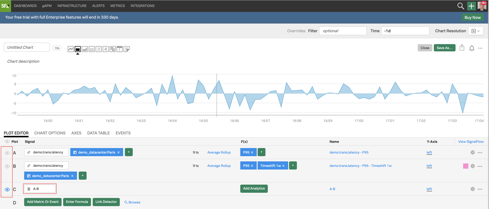
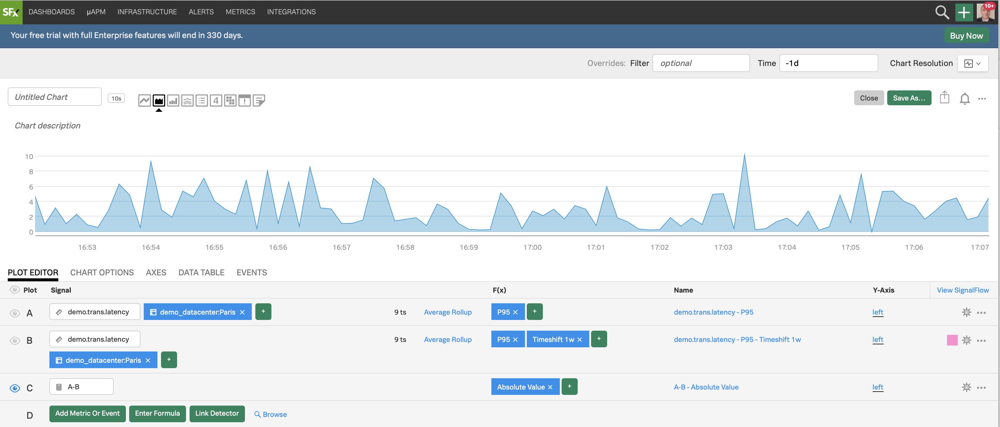

# Using Formulas

## 1. Plotting differences

Let's now plot the difference of all metric values for a day with 7 days in between.

Click on **Enter Formula** then enter **`A-B`** (A minus B) and hide (deselect) all Signals using the eye, except **C**.

{: .zoom}

We now see only the difference of all metric values of **A** and **B** being plotted. We see that we have some negative values on the plot because a metric value of **B** has some times larger value than the metric value of **A** at that time.

Click on **DATA TABLE** and in that view swipe horizontally along the X axis to see the metric values at different times.

## 2. Using Absolute Value

Click on **PLOT EDITOR** to get back to the Plot Editor view.

Let's apply another function to get the values of **C** to positive values.

!!! note
    By doing so we will see the difference between the metric values for a period of 24 hours with 7 days between.

    This difference can be used to see an alarming trend if we consider last week to be a baseline (the bigger the number - the more we deviate from the baseline) - but mainly we do this for you to get a bit more training on using analytical functions!

In the **PLOT EDITOR** for **C**, under **F(x)**, click on **Add Analytics** and choose **`Absolute Value`**.

{: .zoom}

You will see the **C** plot now having only positive values.

{: .zoom}
