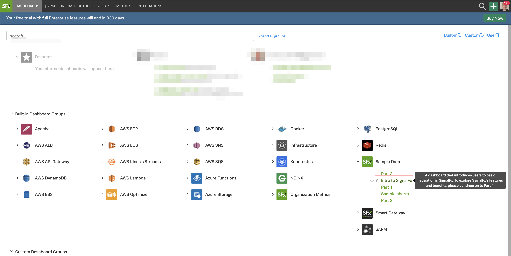

# Working with Dashboards, Charts and Metrics

* Introduction to the SignalFx Dashboards and charts
* Editing and creating charts
* Filtering and analytical functions
* Using formulas
* Introduction to SignalFlow

---

## 1. Introduction to the SignalFx environment

Logon to the SignalFx organization you have been invited to

Hover over _**DASHBOARDS**_ in the top menu, and then click on All Dashboards. A number of prebuilt dashboards are provided for you in your default view.

If you are already receiving metrics through a Cloud API integration or the Smart Agent you will see relevant dashboards for these services in SignalFx.

Among the dashboards you will see a Dashboard group called Sample Data. This group exists by default in all SignalFx accounts. Let's take a closer look at it.

---

## 2. Inspecting the Sample Data

In the All Dashboards view expand the Sample Data dashboard group by clicking on it, and then click on Intro to SignalFx dashboard

{: .zoom}

You will see a selection of sample charts. To learn more about charts you can click on the Intro to SignalFx, Part 1, 2 and Part 3 dashboards and read the description of the charts and its metrics.

Let's take a look at the Sample charts. Click on the **SAMPLE CHARTS** dashboard name:

In the **SAMPLE CHARTS** dashboard you see a selection of charts that show a sample of the various styles, colors and formats you can apply to your charts in the dashboards.
