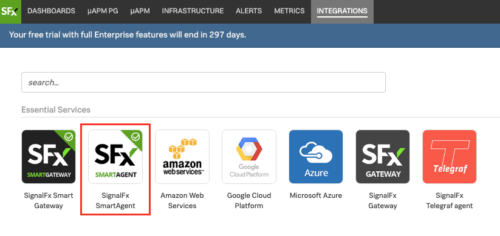
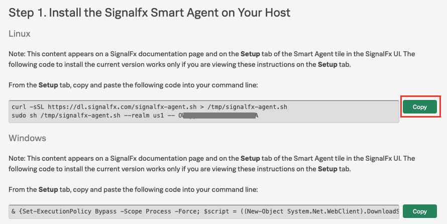
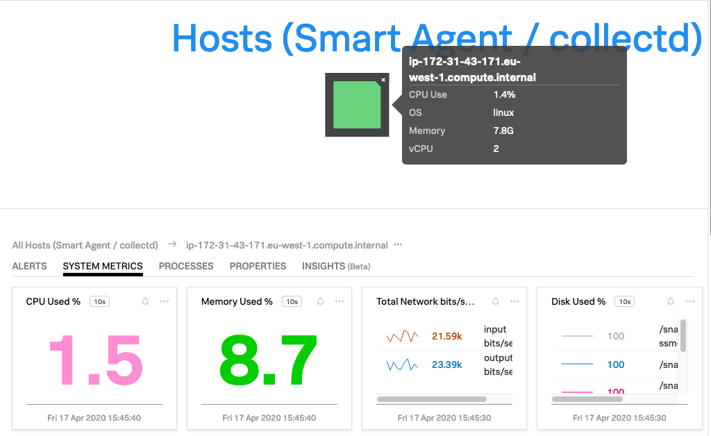

### Lab Summary

1. Deploy SignalFx Smart Agent via install script on a VM
1. Confirm the Smart Agent is working and sending data
3. Stop the agent on the VM

---

### 1. Deploy SignalFx Smart Agent via install script on a VM

Login into the SignalFx UI and click on **INTEGRATIONS** on the top menu bar. Click on the SignalFx SmartAgent tile



In the modal window that appears click on **SETUP** and click **Copy** from the Linux instructions and paste into your Multipass shell
`````
=== "Output"
    ```text
    ubuntu@rwc-k3s:~$ curl -sSL https://dl.signalfx.com/signalfx-agent.sh > /tmp/signalfx-agent.sh
    ubuntu@rwc-k3s:~$ sudo sh /tmp/signalfx-agent.sh --realm us1 -- -rxxxxxxxxxxxxxxxxg
    Ingest URL: https://ingest.us1.signalfx.com
    API URL: https://api.us1.signalfx.com
    Installing package signalfx-agent (latest) from release repo
    Get:1 http://mirrors.ubuntu.com/mirrors.txt Mirrorlist [736 B]
    Get:4 http://mirror.as29550.net/archive.ubuntu.com bionic-backports InRelease [74.6 kB]
    Get:3 http://archive.ubuntu.com/ubuntu bionic-updates InRelease [88.7 kB]
    Hit:5 http://uk-mirrors.evowise.com/ubuntu bionic-security InRelease
    Hit:2 http://mirrors.ukfast.co.uk/sites/archive.ubuntu.com bionic InRelease
    ....
    Processing triggers for systemd (237-3ubuntu10.39) ...
    Processing triggers for man-db (2.8.3-2ubuntu0.1) ...
    Processing triggers for ureadahead (0.100.0-21) ...
    The SignalFx Agent has been successfully installed.

    Make sure that your system's time is relatively accurate or else datapoints may not be accepted.

    The agent's main configuration file is located at /etc/signalfx/agent.yaml.
    ubuntu@rwc-k3s:~$ 
    ```
`````


Once the installation is complete check the status of the agent

=== "Input"
    ```text
    signalfx-agent status
    ```

And validate that it is running.

!!! Note 
    Remember the value displayed for you in the _Host:_ name in the _Global Dimensions_ section of the output, as you need this later

=== "Output"
    ```text
    SignalFx Agent version:           5.1.1
    Agent uptime:                     4s
    Observers active:                 host
    Active Monitors:                  9
    Configured Monitors:              9
    Discovered Endpoint Count:        16
    Bad Monitor Config:               None
    Global Dimensions:                {host: as-k3s}
    GlobalSpanTags:                   map[]
    Datapoints sent (last minute):    0
    Datapoints failed (last minute):  0
    Datapoints overwritten (total):   0
    Events Sent (last minute):        0
    Trace Spans Sent (last minute):   0
    Trace Spans overwritten (total):  0

    Additional status commands:

    signalfx-agent status config - show resolved config in use by agent
    signalfx-agent status endpoints - show discovered endpoints
    signalfx-agent status monitors - show active monitors
    signalfx-agent status all - show everything
    ```

---

### 2. Confirm the Smart Agent is working and sending data

To see the Metrics that the Smart Agent is sending to SignalFx, please goto the SignalFX UI,  and select  **Infrastructure → Hosts**   to see the lists of hosts.


Here you see a list of the Nodes that have an Smart Agent installed and are reporting into SignalFx. Make sure you see your Multipass/EC2 instance in the list of hosts. (The hostname from the previous section) 

You can also set a filter for just your instance by selecting the _host:_  attribute, followed by picking the name of your host from the drop down list.


Click on the link to your host from the list, this wil take you to the overview page of your host.

Make sure you have the **SYSTEM METRIC**  tab selected. Here you can see various charts that relate to the health of your host, like CPU &  Memory Used%, Disk I/O and many more.
You can also see the list of seervices running on your host by selecting  the **PROCESSES** tab.



Take a moment to explore the various charts and the Processes list.

---

### 3. Stop the agent on the VM

In the next module we are going to roll out the agent on the Kubernetes cluster. Before doing that, stop the VM agent with the following command:

```
sudo service signalfx-agent stop
```

---

Use the **Next** link in the footer below to continue the workshop
