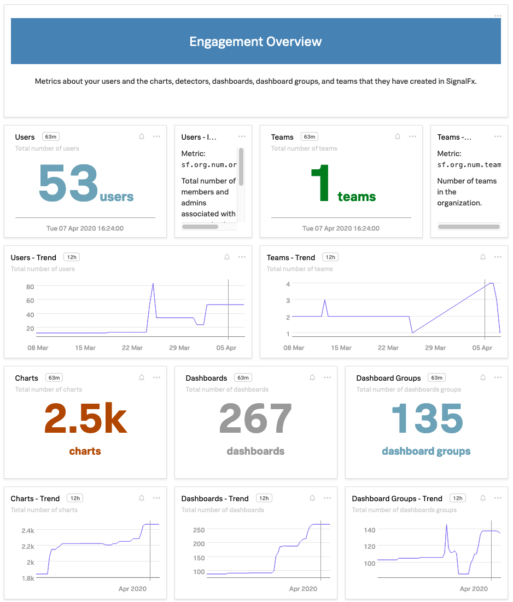

### Lab Summary

*  How to keep track of the usage of SignalFx in your organization.
*  Learn how to keep track of spend by exploring the Billing and Usage interface.

---

### 1. Understanding SignalFx engagement

To fully understand SignalFx adoption inside your organization, click on the **Settings** icon on the top right of the SignalFx UI,

It may also look like this . 
From the drop down, select the **Organizations Settings → Organization Overview** menu item, this will provide 
you with the following dashboard that shows you how your SignalFx organization is being used:

 
On the left, you will see a list of registered users (blurred for privacy in the above screenshot), and the various charts that show you the number of registered users, chart's and dashboards created and growth trends.

The screenshot is taken from an actual organization, the workshop organization you're looking at 
may have less data to work with.
Take a minute to explore the various charts in the Organization over view of the workshop instance.

---

### 2. Usage and Billing
If you want to see what your spend is against your contract you can either select the  **Settings** icon on the top right of the SignalFx UI again,

but this time select the **Organizations Settings → Billing and Usage** tab, or the faster way, select the **Usage and Billing** tab from the left pane!

This screen may take a few seconds to load whilst it calculates the usage.

---

### 3. Understanding usage
You should see a screen similar like the one below  that will give you an overview of the current usage, 
the average usage  and your entitlement per category : Nodes, Containers, Customer Metrics and 
High Resolution Metrics.  

For more information on what these are please read [Billing and Usage information](https://docs.signalfx.com/en/latest/admin-guide/usage.html#viewing-billing-and-usage-information)
 

***
####Let's examine this page in more detail. 

The top chart shows you the current allotment per category,
(shown at the red arrows at the top in the screenshot below), as wel as your current usage of the four catagories. (Shown at the red lines at the bottom of the chart, as you can see we consumed 
18 hosts, 0 containers and 1038 custom metrics and 0 high resolution metrics) 

In the bottom chart, you can see the usage per category for the current period (shown in the 
drop-down box on the top right of the chart.) 
The blue line marked _Average usage_ indicates what SignalFx will use to calculate your average usage for the current period. 

!!! info

    As you can see from the screenshot, SignalFx does not use High water mark or p95% for cost calculation but the actual average usage, allowing you do performance testing or Blue/Green style deployments etc. without risk of overage charges.

In the pane on the right  shows you information about your organizations and contract end date.

To get a feel of the options you can change the category type by the drop down on the left or the time period with the right drop box.

Please take a minute to explore the different time periods & categories and their views.
