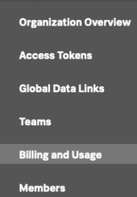
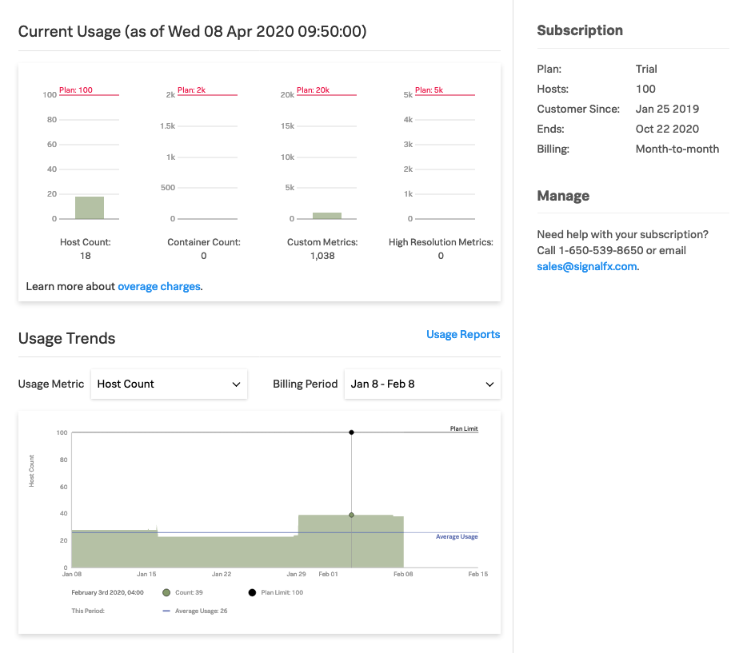
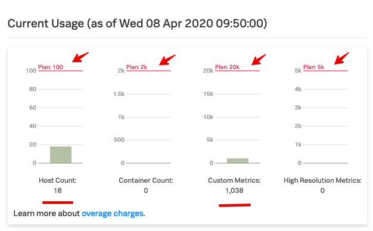
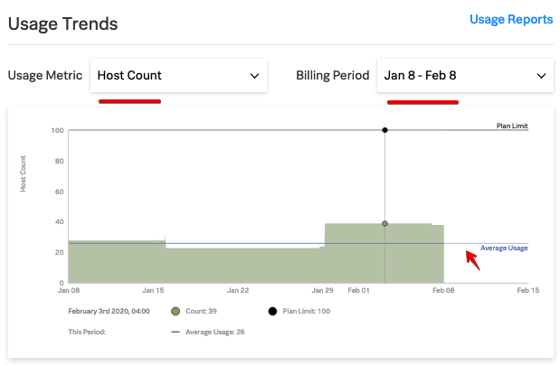
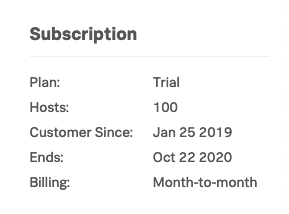

# Billing and Usage - Lab Summary

* How to keep track of the usage of SignalFx in your organization.
* Learn how to keep track of spend by exploring the Billing and Usage interface.

---

## 1. Understanding SignalFx engagement

To fully understand SignalFx adoption inside your organization, click on the **Settings** icon on the top right of the SignalFx UI,

It may also look like this .
From the drop down, select the **Organizations Settings → Organization Overview** menu item, this will provide you with the following dashboard that shows you how your SignalFx organization is being used:

On the left hand menu (not shown in the above screenshot) you will see a list of members, and in the centre, various charts that show you the number of users, teams, charts, dashboards, and Groups created, as well as various growth trends.

The screenshot is taken from an actual organization, the workshop organization you're looking at may have less data to work with.

Take a minute to explore the various charts in the Organization Overview of the workshop instance.

---

## 2. Usage and Billing

If you want to see what your spend is against your contract you can select either the **Settings** icon on the top right of the SignalFx UI again,

but this time select the **Organizations Settings → Billing and Usage** tab, or the faster way, select the **Usage and Billing** tab from the left pane!

This screen may take a few seconds to load whilst it calculates the usage.

---

## 3. Understanding usage

You should see a screen similar like the one below  that will give you an overview of the current usage, the average usage  and your entitlement per category : Nodes, Containers, Customer Metrics and High Resolution Metrics.  

For more information about about these elements please refer to [Billing and Usage information](https://docs.signalfx.com/en/latest/admin-guide/usage.html#viewing-billing-and-usage-information)

---

### 3.1. Let's examine this page in more detail

The top chart shows you the current allotment per category (shown by the red arrows at the top in the screenshot below) as well as your current usage of the four catagories. (Shown at the red lines at the bottom of the chart, as you can see we consumed 18 Hosts, 0 Containers and 1038 Custom Metrics and 0 High Resolution Metrics).

In the bottom chart, you can see the usage per category for the current period (shown in the drop-down box on the top right of the chart).

The blue line marked _Average Usage_ indicates what SignalFx will use to calculate your average usage for the current period.

!!! info

    As you can see from the screenshot, SignalFx does not use High water mark or p95% for cost calculation but the actual average usage, allowing you to do performance testing or Blue/Green style deployments etc. without the risk of overage charges.

To get a feel for the options you can change the metric displayed by selecting the different options from the Usage Metric drop down on the left, or change the the time period with the drop down on the right.

Please take a minute to explore the different time periods & categories and their views.

Finally, the pane on the right shows you information about your Subscription.

