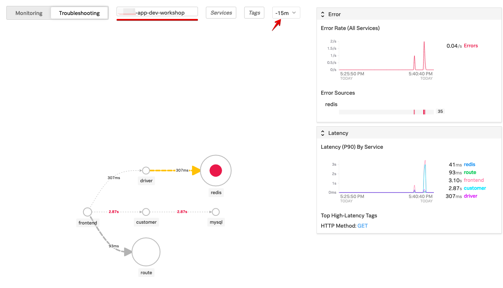

# Deploying Hot R.O.D. in K3s

!!! important "Enabling µAPM"

    An Organization needs to be pre-provisioned as a µAPM entitlement is required for the purposes of this module. Please contact someone from SignalFx to get a trial instance with µAPM enabled if you don’t have one already.

    To check if you have an Organization with µAPM enabled, just login to SignalFx and check that you have the µAPM tab on the top navbar next to Dashboards.

## 1. Create an instance running Kubernetes

The setup part is already documented in the [Preparation section](../../module3/prep/) & [Install k3s section](../../module3/k3s/).  

You can reuse your current running instance, or start afresh (If you start afresh, please run both sections before continuing).

---

## 2. Deploy the Hot R.O.D. application into K3s

To deploy the Hot R.O.D. application into K3s apply the deployment
  
=== "Input"

    ```bash
    kubectl apply -f ~/workshop/apm/hotrod/k8s/deployment.yaml 
    ```

=== "Output"

    ```text
    deployment.apps/hotrod created
    service/hotrod created
    ```

To ensure the Hot R.O.D. application is running:

=== "Input"

    ```bash
    kubectl get pods
    ```

=== "Output"

    ```text
    NAME                      READY   STATUS    RESTARTS   AGE
    signalfx-agent-mmzxk      1/1     Running   0          110s
    hotrod-7cc9fc85b7-n765r   1/1     Running   0          41s
    ```

---

## 3. Viewing the Hot R.O.D. application in your browser

(If you are using an EC2 instance, please skip to the next section [Generate Traffic](../../module6/hotrod/#4-generate-some-traffic-to-the-application-using-apache-benchmark)).

In order to view the application in your web browser we need to find the LoadBalancer IP address and the port the application is listening on.

=== "Input"

    ```bash
    kubectl get svc
    ```

=== "Output"

    ```text
    NAME         TYPE           CLUSTER-IP    EXTERNAL-IP     PORT(S)          AGE
    kubernetes   ClusterIP      10.43.0.1     <none>          443/TCP          43m
    hotrod       LoadBalancer   10.43.32.97   192.168.64.35   8080:31521/TCP   40m
    ```

Make note of the `EXTERNAL-IP` (in the example above this is `192.168.64.35`). Then head over to your web browser and type in `http://[EXTERNAL-IP]:8080`, you should then be able to see the application running. Click on customer names to order a car:


---

## 4. Generate some traffic to the application using Apache Benchmark

Return to your shell and create an environment variable for the IP address and port that the Hot R.O.D. application is exposed on:

=== "Input"

    ```
    HOTROD_ENDPOINT=$(kubectl get svc hotrod -n default -o jsonpath='{.spec.clusterIP}:{.spec.ports[0].port}')
    ```
then run the following command to create load on the service:

=== "Input"

    ```bash
    ab -n10 -c10 "http://$HOTROD_ENDPOINT/dispatch?customer=392&nonse=0.17041229755366172"
    ```

Create some errors with an invalid customer number

=== "Input"

    ```bash
    ab -n10 -c10 "http://$HOTROD_ENDPOINT/dispatch?customer=391&nonse=0.17041229755366172"
    ```

---

## 5. Verify that APM traffic is reaching SignalFx

Open SignalFx in your browser and select the APM tab to open the APM UI.

{: .zoom}

Select the troubleshooting tab, and select your environment and set the time to 15 minutes.
This  should show you the dependency map for the hotrod app



If you did create some errors, they show up as the big red dot in the Redis service.
