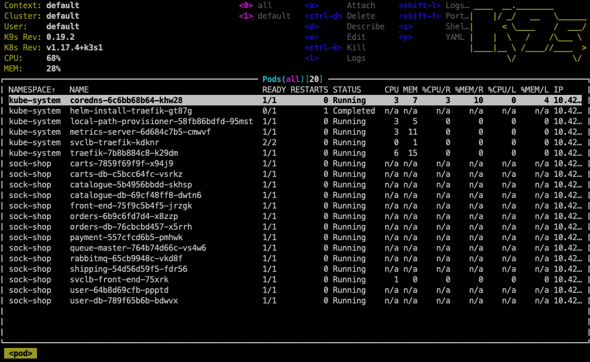
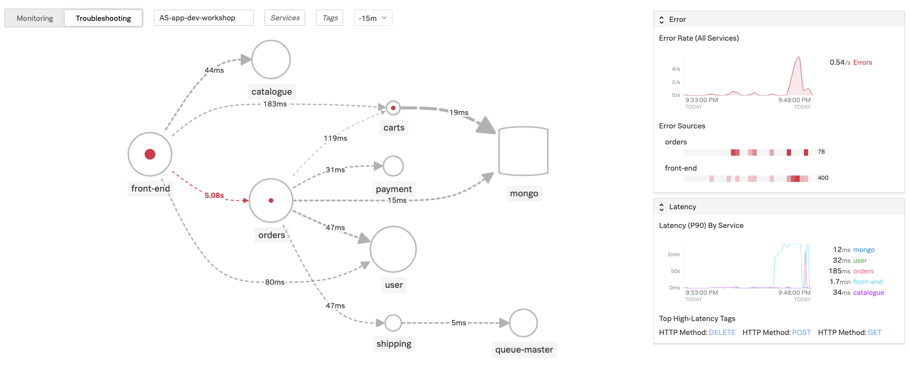
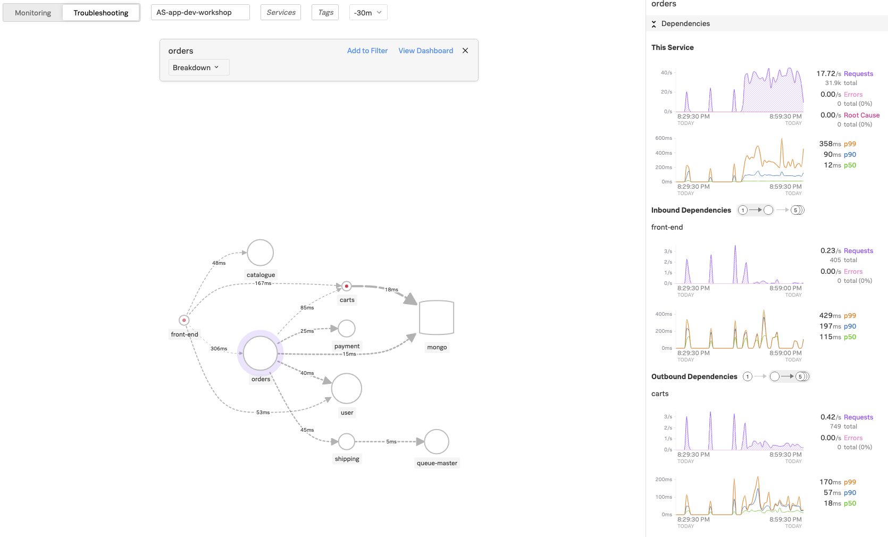
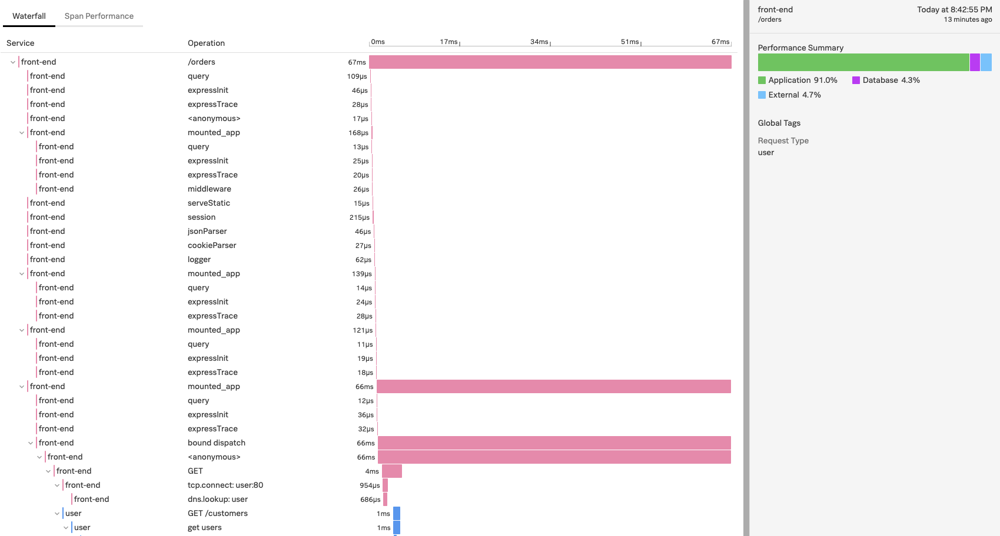
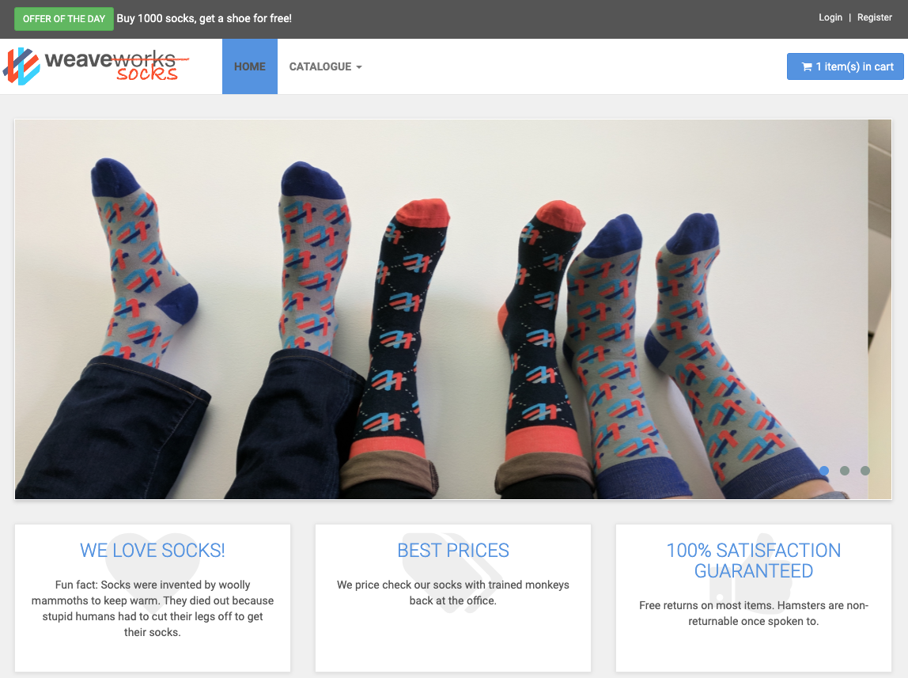

# Deploying Sock Shop in K3s

## Enabling µAPM

_An organisation needs to be pre-provisioned as a µAPM entitlement is required for the purposes of this module. Please contact someone from SignalFx to get a trial instance with µAPM enabled if you don’t have one already._

_To check if you have an organisation with µAPM enabled, just login to SignalFx and check that you have the µAPM tab on the top navbar next to Dashboards._

---

### 1. Create an instance running Kubernetes

The setup part is already documented in the [Preparation section](https://signalfx.github.io/app-dev-workshop/module3/prep/) & [Install k3s section](https://signalfx.github.io/app-dev-workshop/module3/k3s/).  

You can reuse your current running instance, or start fresh
(If you start fresh, please run both sections before continuing).

!!! Warning
    The Sock Shop application requires some horse power to run it, please ensure you are running a Multipass instance that can handle it.

    **Sock Shop minimum requirements:** 2 vCPU, 10Gb Disk, 4Gb Memory 

---

### 2. Deploy the Sock Shop application into K3s

To deploy the Sock Shop application into K3s apply the deployment

=== "Input"

    ```bash
    cd ~/workshop/apm/sockshop
    kubectl create namespace sock-shop
    kubectl apply -f k8s/complete-demo.yaml
    ```

=== "Output"

    ```text
    namespace/sock-shop created
    deployment.apps/carts-db created
    service/carts-db created
    deployment.apps/carts created
    service/carts created
    deployment.apps/catalogue-db created
    service/catalogue-db created
    deployment.apps/catalogue created
    service/catalogue created
    deployment.apps/front-end created
    service/front-end created
    deployment.apps/orders-db created
    service/orders-db created
    deployment.apps/orders created
    service/orders created
    deployment.apps/payment created
    service/payment created
    deployment.apps/queue-master created
    service/queue-master created
    deployment.apps/rabbitmq created
    service/rabbitmq created
    deployment.apps/shipping created
    service/shipping created
    deployment.apps/user-db created
    service/user-db created
    deployment.apps/user created
    service/user created
    ```

---

### 3. Ensure Sock Shop is fully deployed

To monitor the deployment of Sock Shop using `k9s` to monitor:

=== "Input"

    ```
    k9s
    ```

Once in `k9s` press `0` to show all namespaces:



---

### 4. Take Sock Shop for a test drive

Sock Shop should be running in your cluster and exposes services via cluster IP and port. Obtain the ip address for the front-end service.

=== "Input"

    ```bash
    SOCKS_ENDPOINT=$(kubectl get svc front-end -n sock-shop -o jsonpath='{.spec.clusterIP}:{.spec.ports[0].port}')
    ```

Then confirm the `SOCKS_ENDPOINT` environment variable has been set:

=== "Input"

    ```bash
    curl $SOCKS_ENDPOINT
    ```

=== "Output"

    ```html
    ...
    </script>
    </body>

    </html>
    ```

---

### 5. Apply load on Sock Shop

A load testing application is available for the Sock Shop application. To generate some load run the following command:

=== "Input"

    ```bash
    kubectl run --generator=run-pod/v1 load-test --rm -i --tty --image weaveworksdemos/load-test -- -d 5 -h $SOCKS_ENDPOINT -c 15 -r 1000
    ```

The parameter `-c` controls the amount of concurrent clients and `-r` the amount of requests sent. To apply continuous load just set `-r` to a higher number.

---

### 6. Visualize and analyze trace data

Navigate to µAPM (*not* µAPM PG) and select Monitoring, then ensure you have selected your environment from the dropdown at the top, you should see something like this:


Explore the User Interface: Review an automatically generated Service Dashboard. How do you correlate Service performance with Infrastructure?


Troubleshoot a service. Let's stress the sock shop a bit. Increase the amount of clients running for the load test to something ludicrous (1000+ seems to do the trick). What happens with the services? Troubleshoot a service with a higher error rate. Also review the service dependencies.





Look at individual traces and span performance.




---

### 7. Viewing the SockShop application in your browser

(If you are using an EC2 instance, please skip to this section.)

In order to view the application in your web browser we need to find the LoadBalancer IP address and the port the application is listening on.

=== "Input"

    ```bash
    kubectl get svc -n sock-shop
    ```

=== "Output"

    ```text
    NAME           TYPE           CLUSTER-IP      EXTERNAL-IP     PORT(S)          AGE
    carts-db       ClusterIP      10.43.221.67    <none>          27017/TCP        34m
    carts          ClusterIP      10.43.61.101    <none>          80/TCP           34m
    catalogue-db   ClusterIP      10.43.57.198    <none>          3306/TCP         34m
    catalogue      ClusterIP      10.43.216.173   <none>          80/TCP           34m
    orders-db      ClusterIP      10.43.236.48    <none>          27017/TCP        34m
    orders         ClusterIP      10.43.115.92    <none>          80/TCP           34m
    payment        ClusterIP      10.43.242.227   <none>          80/TCP           34m
    queue-master   ClusterIP      10.43.73.136    <none>          80/TCP           34m
    rabbitmq       ClusterIP      10.43.113.211   <none>          5672/TCP         34m
    shipping       ClusterIP      10.43.250.115   <none>          80/TCP           34m
    user-db        ClusterIP      10.43.152.153   <none>          27017/TCP        34m
    user           ClusterIP      10.43.45.155    <none>          80/TCP           34m
    front-end      LoadBalancer   10.43.247.97    192.168.64.35   8081:30001/TCP   34m
    ```

Make note of the `EXTERNAL-IP` (in the example above this is `192.168.64.35`). Then head over to your web browser and type in `http://{EXTERNAL-IP}:8081`, you should then be able to see the application running. Happy Shopping!


