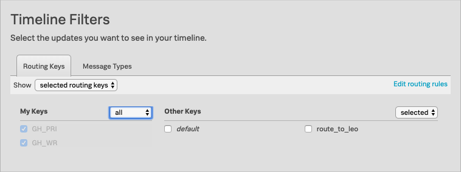
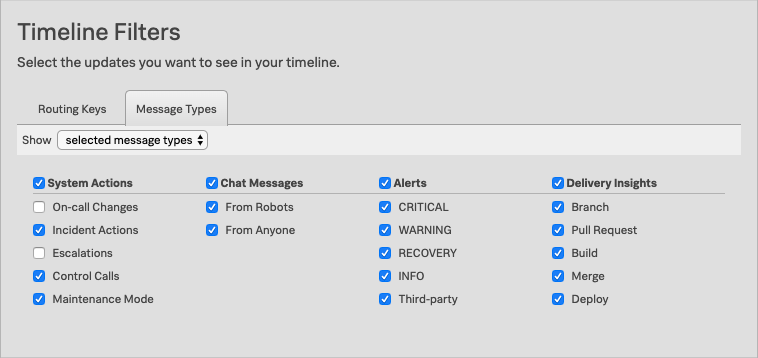
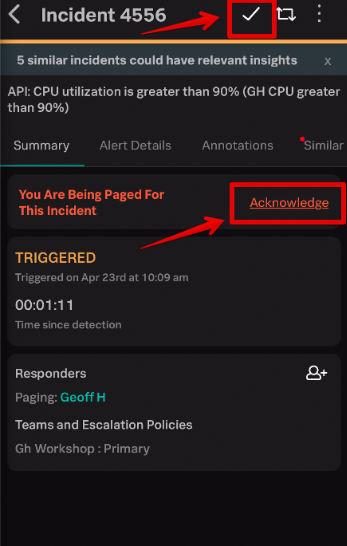
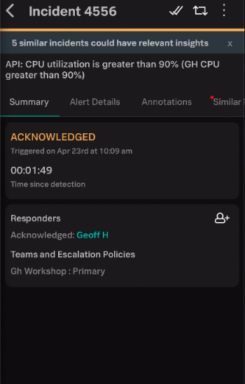

# Lab Summary

1. UI Overview
2. Generate Incidents
3. Manage Incidents

---

## 1. UI Overview

The aim of VictorOps is to "Make On Call Suck Less", and it does this by getting the critical data, to the right people, at the right time.

The key to making VictorOps work for you is to centralize all your alerting sources, sending them all to the VictorOps platform, then you have a single pane of glass in which to manage all of your alerting.

Login to the VictorOps UI and select the `Timeline` tab on the main menu bar, you should have a screen similar to the following image:


### 1.1 People

On the left we have the `People` section with the `Teams` and `Users` sub tabs. On the `Teams` tab, click on `All Teams` then expand &lt;Your Teamname&gt;. Users with the VictorOps Logo against their name are currently on call. Here you can see who is on call within a particular Team, or across all Teams via `Users` -> `On-Call`.

If you click into one of the currently on call users, you can see their status. It shows which Rotation they are on call for, when their current Shift ends and their next Shift starts (times are displayed in your timezone), what contact methods they have and which Teams they belong to (dummy users such as Hank do not have Contact Methods configured).


### 1.2 Timeline

In the centre `Timeline` section you get a realtime view of what is happening within your environment with the newest messages at the top.  Here you can quickly post update messages to make your colleagues aware of important developments etc.  You can filter the view using the buttons on the top toolbar showing only update messages, github integrations, or apply more advanced filters.

Lets change the Filters settings to streamline your view. Click the `Filters` button then within the `Routing Keys` tab change the `show` setting from `all routing keys` to `selected routing keys`, then change the `My Keys` value to `all` and the `Other Keys` value to `selected` and deselect all keys under the Other Keys section. Click anywhere outside of the dialogue box to close it.



You will probably now have a much simpler view as you will not currently have Incidents created using your Routing Keys, so you are left with the other types of messages that the Timeline can display.

Click on `Filters` again, but this time switch to the `Message Types` tab.  Here you control the types of messages that are displayed.  For example deselect `On-call Changes` and `Escalations`, this will reduce the amount of messages displayed.



### 1.3 Incidents

On the right we have the `Incidents` section.  Here we get a list of all the incidents within the platform, or we view a more specific list such as incidents you are specifically assigned to, or for any of the Teams you are a member of.

Select the `Team Incidents` tab you should find that the `Triggered`, `Acknowledged` & `Resolved` tabs are currently all empty as you have had no incidents logged, yet so let's change that by generating your first incident.  

---

## 2. Generate Incidents

### 2.1 On-Call

Before generating any incidents you should assign yourself to the current `Shift` within your `Follow the Sun Support - Business Hours` Rotation and also place yourself `On-Call`.

* Click on the `Schedule` link within your `Team` in the `People` section on the left
* Or navigate to `Teams` -> `<Your Team>` -> `Rotations`
* Expand the `Follow the Sun Support - Business Hours` Rotation
* Click on the `Manage members` icon (the figures) for the current active shift depending on your timezone
* Use the `Select a user to add...` dropdown to add yourself to the shift
* Then click on `Set Current` to make yourself the current `on-call` user within the shift
* You should now get a `Push Notification` to your phone informing you that `You Are Now On-Call`


### 2.2 Trigger Alert

Log into your first VM you created during step [2. Creating a Test Environment](../vo_integrations/#2-creating-a-test-environment) in VictorOps Integrations

=== "Input"

    ```
    multipass shell <YOUR INITIALS>-vo1
    ```

=== "Example"

    ```
    multipass shell gh-vo1
    ```

=== "Output"

    ```
    Welcome to Ubuntu 18.04.4 LTS (GNU/Linux 4.15.0-96-generic x86_64)
    
     * Documentation:  https://help.ubuntu.com
     * Management:     https://landscape.canonical.com
     * Support:        https://ubuntu.com/advantage
    
      System information as of Wed Apr 22 11:13:48 BST 2020
    
      System load:  0.0               Processes:             105
      Usage of /:   88.7% of 1.96GB   Users logged in:       0
      Memory usage: 19%               IP address for enp0s2: 192.168.64.13
      Swap usage:   0%
    
      => / is using 88.7% of 1.96GB
    
     * Kubernetes 1.18 GA is now available! See https://microk8s.io for docs or
       install it with:
    
         sudo snap install microk8s --channel=1.18 --classic
    
     * Multipass 1.1 adds proxy support for developers behind enterprise
       firewalls. Rapid prototyping for cloud operations just got easier.
    
         https://multipass.run/
    
     * Canonical Livepatch is available for installation.
       - Reduce system reboots and improve kernel security. Activate at:
         https://ubuntu.com/livepatch
    
    0 packages can be updated.
    0 updates are security updates.
    
    
    Last login: Tue Apr 21 17:29:23 2020 from 192.168.64.1
    To run a command as administrator (user "root"), use "sudo <command>".
    See "man sudo_root" for details.
    
    ubuntu@gh-vo1:~$
    ```

Force the CPU to spike to 100% by running the following command:

=== "Input"

    ```
    openssl speed -multi $(grep -ci processor /proc/cpuinfo)
    ```

=== "Output"

    ```
    Forked child 0
    +DT:md4:3:16
    +R:19357020:md4:3.000000
    +DT:md4:3:64
    +R:14706608:md4:3.010000
    +DT:md4:3:256
    +R:8262960:md4:3.000000
    +DT:md4:3:1024
    ```

This will result in an Alert being generated by SignalFx which in turn will generate an Incident within VictorOps within a maximum of 10 seconds as this is the default poling time for the SignalFx Agent we installed (it can be reduced to 1sec if required).

---

## 3. Managing Incidents

Use your VictorOps App on your phone to acknowledge the Incident by clicking on the `push notification`...


...clicking on the alert...


...then clicking on either the `single tick` in the top right hand corner, or the `Acknowledge` link.  

The `single tick` will then transform into a `double tick`, and the status will change from `TRIGGERED` to `ACKNOWLEDGED`.




Still on your phone, select the Alert Details tab.  Then on the Web UI, navigate back to `Timeline`, select `Team Incidents` on the right, then select `Acknowledged` and click into the new `Incident`.

You should now have the `Details` tab displayed on both your Phone and the Web UI. Notice how they both show the exact same information.

Now select the `Annotations` tab on both the Phone and the Web UI, you should have a `Graph` displayed in the UI which is generated by SignalFx.  


On your phone click the `Chart Showing Alert` link...


...and you should now get the exact same image on your phone.


VictorOps is a 'Mobile First' platform meaning the phone app is full functionality and you can manage an incident directly from your phone. For the remainder of this module we will focus on the Web UI however please spend some time later exploring the phone app features.

Sticking with the Web UI, click the `2. Alert Details in SignalFx` link...


...this will open a new browser tab and take you directly to the Alert within SignalFx where you could then progress your troubleshooting using the powerful tools built into the SignalFx UI.  However, we are focussing on VictorOps so close this tab and return to the VictorOps UI.

What if VictorOps could identify previous incidents within the system which may give you a clue to the best way to tackle this incident.  The `Similar Incidents` tab does exactly that, surfacing previous incidents allowing you to look at them and see what actions were taken to resolve them, actions which could be easily repeated for this incident.


At the top right in the UI are a number of icons that allow quick access to various actions, click on the far right one which will open this Incident in a new window.


With the Incident expanded, you can see on the right we have a Time Line view where you can add messages and see the history of previous alerts and interactions.


On the far left you have the option of allocating additional resources to this incident by clicking on the `Add Responders` link.  This allows you build a virtual team specific to this incident by adding other Teams or individual Users, and also share details of a `Conference Bridge` where you can all get together and collaborate. Close the `Add Responders` dialogue by clicking `cancel`.

You can also `snooze` this incident for up to 24hrs by clicking on the `alarm clock` in the very top left, or `re-route` it to a different team who may be better placed to deal with this particular incident.

Now lets fix this issue and update the Incident with what we did.  Add a new message at the top right such as `Discovered rogue process, terminated it`.


Now kill off the process we started in the VM to max out the CPU. Within no greater than 10 seconds SignalFx should detect the new CPU value, clear the alert state in SignalFx, then automatically update the Incident in VictorOps marking it as `Resolved'.


---

That completes this introduction to VictorOps, but feel free to checkout the more advanced modules which will be published in the coming weeks in the `Optional Modules` section.  These will cover topics such as:

* Reporting
* Using the API
* Webhooks
* Alert Rules Engine
* Maintenance Mode
