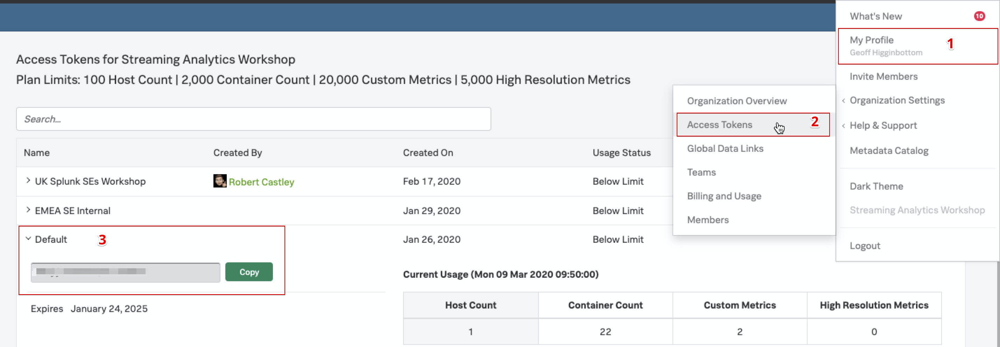
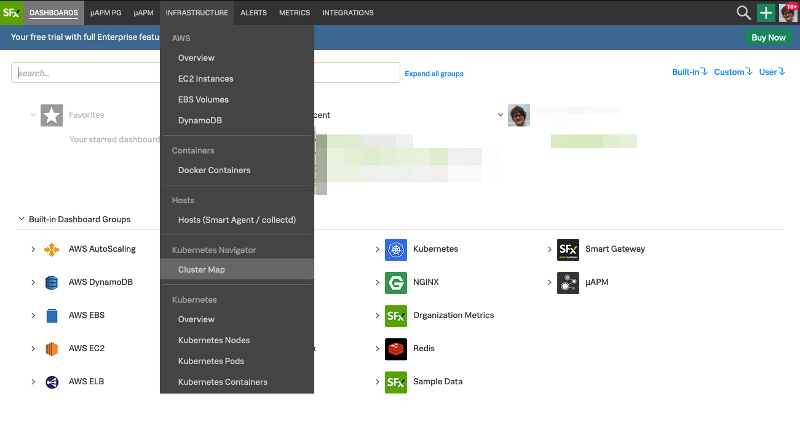
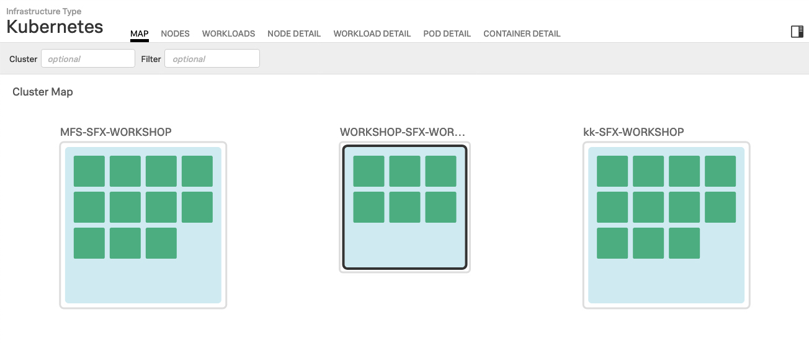
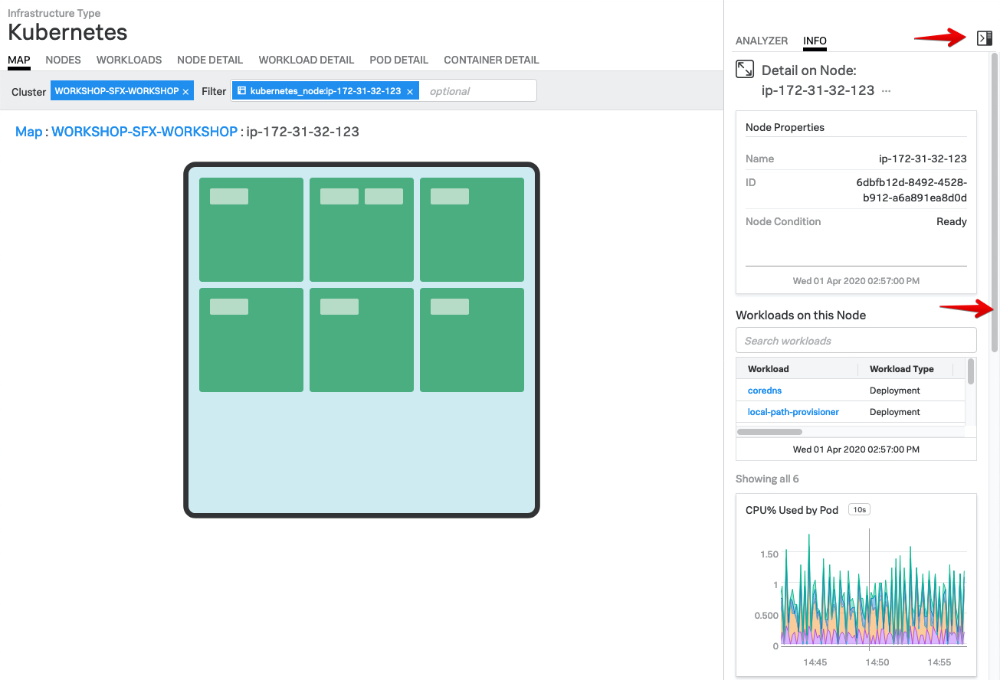

## Summary of this lab:

* Download the workshop and configure Kubernetes ([K3s](https://k3s.io/)) environment.
* Use the SignalFx Helm chart to install the Smart Agent in K3s.
* Explore Your cluster in the Kubernetes Navigator

If you have chosen to run the workshop on a AWS/EC2 instance, please follow instructions and go to **Step #2**.

---

### 1. Let’s bake some K8s

Install [Multipass][] for your OS. On a Mac you can also install via `brew` e.g. `brew cask install multipass`

[Multipass]: https://multipass.run/

Download the App Dev Workshop master zip file, unzip the file and change into the app-dev-workshop-master directory

```bash
curl -LO https://github.com/signalfx/app-dev-workshop/archive/master.zip
unzip master.zip
cd app-dev-workshop-master
```

Launch the Multipass instance which will run Kubernetes. **Note:** Use `{YOUR_INITIALS}-k3s` this is so the value of the instance hostname is unique e.g. `rwc-k3s`

```bash
multipass launch --name {YOUR_INITIALS}-k3s --cloud-init cloud-init-k3s.yaml --cpus=2 --mem=2G
```

Once the instance has been successfully created shell into it.

```bash
multipass shell {YOUR_INITIALS}-k3s
```

---

### 2. I’ve got the key, I’ve got the secret!

You will need to obtain your Access Token from the SignalFx UI once Kubernetes is running. You can find your Access Token by clicking on your profile icon on the top right of the SignalFx UI. Then select _**Organisation Settings → Access Tokens**_.  Expand the Default token, then click on _**Show Token**_ to expose your token. Later in the lab you can come back here and click the _**Copy**_ button which will copy it to your clipboard  so you can paste it when you need to provide an access token in the lab.


You will also need to obtain the name of the Realm for your SignalFx account.  Click on the profile icon again, but this time select 'My Profile'.  The Ream can be found in the middle of the page within the Organizations section.  In this example it is `us1`.


---

## Step 3: Take the Helm!

Create the following variables to use in the proceeding helm install command:

```
export ACCESS_TOKEN=<token from Step 2>
export REALM=<realm from Step 2>
export INITIALS=<your initials e.g. GXH>
export VERSION=<Smart Agent version e.g. 5.0.4>
```

**Note:** The latest version of the Smart Agent can be found on [GitHub](https://github.com/signalfx/signalfx-agent/releases)

Install the agent using the SignalFx Helm chart. Firstly, add the SignalFx Helm chart repository to Helm.

```
helm repo add signalfx https://dl.signalfx.com/helm-repo
```

Ensure the latest state of the SignalFx Helm repository

```
helm repo update
```

Install the Smart Agent Helmchart with the following commands:

```
sed -i -e 's/\[INITIALS\]/'"$INITIALS"'/' workshop/k3s/values.yaml
helm install --set signalFxAccessToken=$ACCESS_TOKEN --set clusterName=$INITIALS-SFX-WORKSHOP --set kubeletAPI.url=https://localhost:10250  --set signalFxRealm=$REALM  --set agentVersion=$VERSION --set traceEndpointUrl=https://ingest.$REALM.signalfx.com/v2/trace --set gatherDockerMetrics=false signalfx-agent signalfx/signalfx-agent -f workshop/k3s/values.yaml
```

You can monitor the progress of the deployment by running `kubectl get pods` which should typically report a new pod is up and running after about 30 seconds. Ensure the status is reported as Running before continuing.

```bash
kubectl get pods
```

```text
NAME                   READY   STATUS    RESTARTS   AGE
signalfx-agent-66tvr   1/1     Running   0          7s
```

Ensure there are no errors by tailing the logs from the Smart Agent Pod. Output should look similar to the log output shown below. Use the label set by the `helm` install to tail logs (You will need to press Ctrl-C to exit). Or use the installed `k9s` terminal UI for bonus points!

```bash
kubectl logs -l app=signalfx-agent -f
```

```text
time="2020-03-15T11:30:28Z" level=info msg="Starting up agent version 5.0.0"
time="2020-03-15T11:30:28Z" level=info msg="Watching for config file changes"
time="2020-03-15T11:30:28Z" level=info msg="New config loaded"
time="2020-03-15T11:30:28Z" level=info msg="Using log level info"
time="2020-03-15T11:30:28Z" level=info msg="Fetching host id dimensions"
time="2020-03-15T11:30:28Z" level=info msg="Trying to get fully qualified hostname"
time="2020-03-15T11:30:28Z" level=info msg="Using hostname PH-k3s"
time="2020-03-15T11:30:29Z" level=info msg="Using host id dimensions map[host:PH-k3s    kubernetes_node_uid:05ba9d7b-89d4-4c70-a3e9-4dc72923423a]"
time="2020-03-15T11:30:29Z" level=info msg="Sending datapoints to https://ingest.us1.signalfx.com/v2/datapoint"
time="2020-03-15T11:30:29Z" level=info msg="Sending events to https://ingest.us1.signalfx.com/v2/event"
time="2020-03-15T11:30:29Z" level=info msg="Sending trace spans to https://ingest.us1.signalfx.com/v1/trace"
time="2020-03-15T11:30:29Z" level=info msg="Setting cluster:SFX-WORKSHOP property on host:PH-k3s dimension"
time="2020-03-15T11:30:29Z" level=info msg="Creating new monitor" discoveryRule= monitorID=1 monitorType=cpu
time="2020-03-15T11:30:29Z" level=info msg="Creating new monitor" discoveryRule= monitorID=2 monitorType=filesystems
time="2020-03-15T11:30:29Z" level=info msg="Creating new monitor" discoveryRule= monitorID=3 monitorType=disk-io
time="2020-03-15T11:30:29Z" level=info msg="Creating new monitor" discoveryRule= monitorID=4 monitorType=net-io
time="2020-03-15T11:30:29Z" level=info msg="Creating new monitor" discoveryRule= monitorID=5 monitorType=load
time="2020-03-15T11:30:29Z" level=info msg="Creating new monitor" discoveryRule= monitorID=6 monitorType=memory
time="2020-03-15T11:30:29Z" level=info msg="Creating new monitor" discoveryRule= monitorID=7 monitorType=host-metadata
time="2020-03-15T11:30:29Z" level=info msg="Creating new monitor" discoveryRule= monitorID=8 monitorType=processlist
time="2020-03-15T11:30:29Z" level=info msg="Creating new monitor" discoveryRule= monitorID=9 monitorType=vmem
time="2020-03-15T11:30:29Z" level=info msg="Creating new monitor" discoveryRule= monitorID=10 monitorType=kubelet-stats
time="2020-03-15T11:30:29Z" level=info msg="Creating new monitor" discoveryRule= monitorID=11 monitorType=kubernetes-cluster
time="2020-03-15T11:30:29Z" level=info msg="Done configuring agent"
time="2020-03-15T11:30:29Z" level=info msg="Serving internal metrics at localhost:8095"
   I0315 11:30:29.922577       1 leaderelection.go:242] attempting to acquire leader lease  default/signalfx-agent-leader...
   I0315 11:30:29.950448       1 leaderelection.go:252] successfully acquired lease default/signalfx-agent-leader
time="2020-03-15T11:30:29Z" level=info msg="K8s leader is now node ph-k3s"
time="2020-03-15T11:30:29Z" level=info msg="Starting K8s API resource sync"
```

In the SignalFx UI, goto _**INFRASTRUCTURE → Kubernetes Navigator → Cluster Map**_ and open the Kubernetes Navigator Cluster Map to ensure metrics are being sent.



---

Validate that your cluster is discovered and shown (In a workshop you can see many more clusters) by finding your cluster by searching for `{YOUR_INITIALS}-SFX-WORKSHOP`:



If there are many clusters you can use the dashboard filter to narrow down to your K8s cluster e.g. `kubernetes_cluster: {YOUR_INITIALS}-SFX-WORKSHOP` or do this by clicking on the blue cross  after selecting your cluster with your mouse.


To examine the health of your cluster, open the side bar by clicking on the  button to open the Metrics side bar. Once it is open, you can use the slider on the side to explore the various charts relevant to your cluster/node: Cpu%, Mem%, Network in & out. Events and Container list.



---

Once you are finished please proceed to [Deploying NGINX in Kubernetes](https://signalfx.github.io/app-dev-workshop/module1/nginx/)
