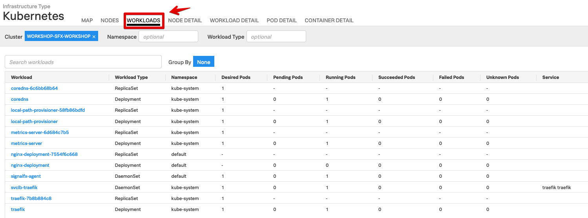
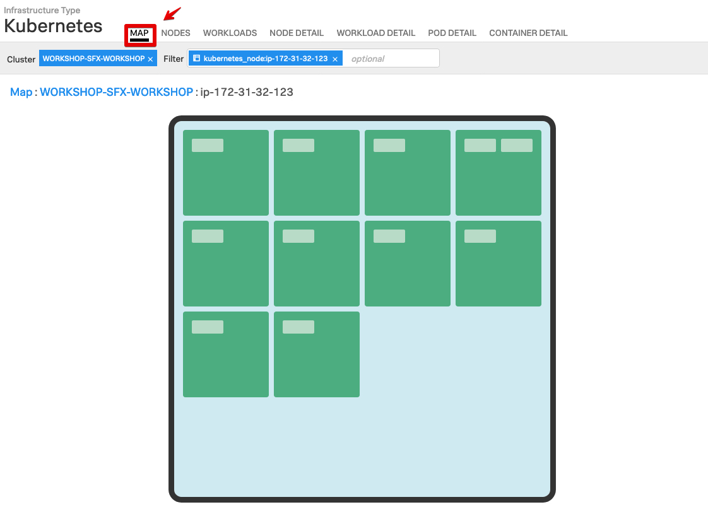
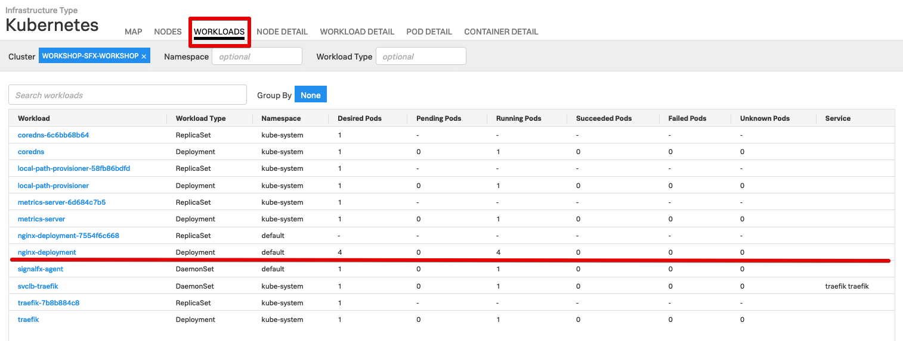

## Lab Summary
* Deploy a NGINX ReplicaSet into your K3s cluster and confirm the auto discovery of your NGINX deployment.
* Run a benchmark test to create metrics and confirm them streaming into SignalFX!

***

### 1. Start your NGINX!
Remain in the Multipass shell session and change into the `nginx` directory:

```bash
cd ~/workshop/k3s/nginx
```

Create the NGINX configmap using the `nginx.conf` file:

```bash
kubectl create configmap nginxconfig --from-file=nginx.conf
```

Verify the number of pods running in the SignalFx UI by selecting the **WORKLOADS** tab. This should give you an overview of the workloads on your cluster.


Note the single agent container running per node among the default Kubernetes pods. This single container will monitor all the pods and services being deployed on this node!

Now switch back to the default cluster node view by selecting  the **MAP** tab and select your cluster again.
  
---
 
### 2. Create NGINX deployment!

```
kubectl create -f nginx-deployment.yaml
```

Validate the deployment has been successful and that the NGINX pods are running. If you have the SignalFx UI open you should see new Pods being started and containers being deployed. It should only take around 20 seconds for the pods to transition into a Running state. In the SignalFx UI you should have a cluster that looks like below:



If you select the **WORKLOADS** tab again you should now see that there is a new replica set and a deployment added for the NGINX deployment:


---

Let's validate this in your shell as well, before creating load on your system:
   
```bash tab="Input"
kubectl get pods
```

```text tab="Output"
NAME                               READY   STATUS    RESTARTS   AGE
signalfx-agent-n7nz2               1/1     Running   0          11m
nginx-deployment-f96cf6966-jhmjp   1/1     Running   0          21s
nginx-deployment-f96cf6966-459vf   1/1     Running   0          21s
nginx-deployment-f96cf6966-vrnfc   1/1     Running   0          21s
nginx-deployment-f96cf6966-7z4tm   1/1     Running   0          21s
```

Next we need to expose port 80 (HTTP)

```bash tab="Input"
kubectl create service nodeport nginx --tcp=80:80
```

```text tab="Output"
service/nginx created
```

Run `kubectl get svc` then make a note of the `CLUSTER-IP` address allocated to the NGINX service.
   
```bash tab="Input"
kubectl get svc
```

```text tab="Output"
NAME         TYPE        CLUSTER-IP     EXTERNAL-IP   PORT(S)        AGE
kubernetes   ClusterIP   10.96.0.1      <none>        443/TCP        9m3s
nginx        NodePort    10.110.36.62   <none>        80:30995/TCP   8s
```

---

### 3. Run a benchmark

Using the NGINX CLUSTER-IP address reported from above, use Apache Benchmark (`ab`) to create some traffic to light up your SignalFx NGINX dashboard. Run this a couple of times to generate some metrics!
   
```bash tab="Input"
ab -n1000 -c20 http://{INSERT_NGINX_IP_ADDRESS}/
```

```text tab="Output"
This is ApacheBench, Version 2.3 <$Revision: 1826891 $>
Copyright 1996 Adam Twiss, Zeus Technology Ltd, http://www.zeustech.net/
Licensed to The Apache Software Foundation, http://www.apache.org/
 
Benchmarking localhost (be patient)
Completed 100 requests
...
Completed 1000 requests
Finished 1000 requests
 
Server Software:        nginx/1.17.5
Server Hostname:        localhost
Server Port:            30995
...
```

Validate you are seeing metrics in the UI by going to _**Dashboards → NGINX → NGINX Servers**_ Tip: you can again apply the filter `kubernetes_cluster: {YOUR_INITIALS}-SFX-WORKSHOP` to focus on only your metrics.

