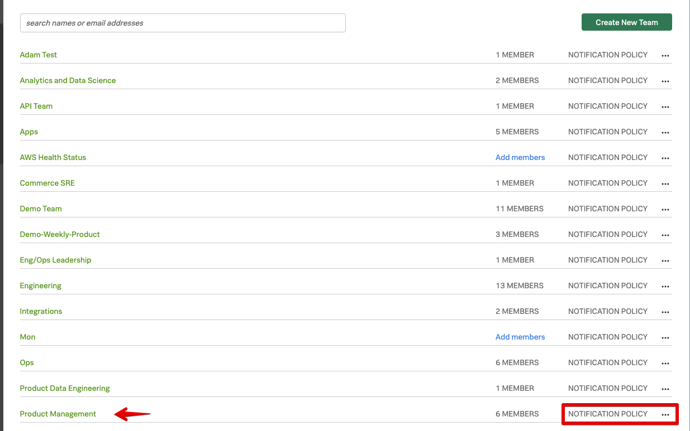
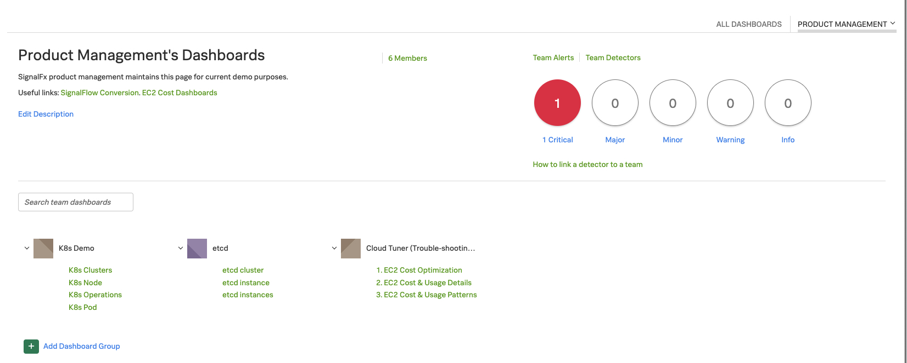
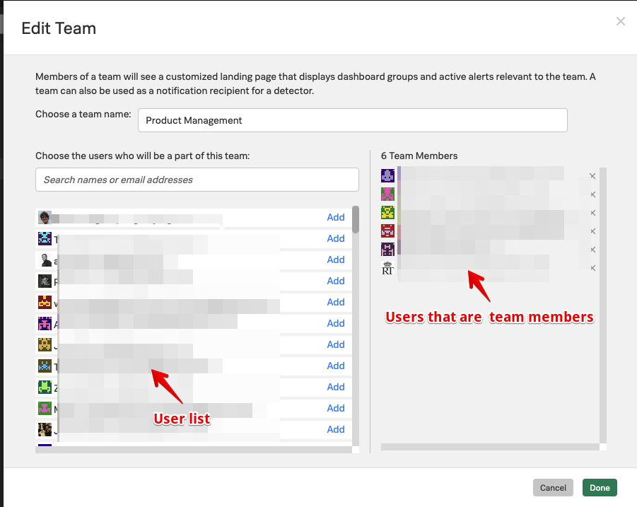

## Lab Summary

*  How to keep track of the usage of SignalFx in your organization.
*  Learn how to keep track of spend by exploring the Billing and Usage interface.
*  Create a team and add members to team
*  Discover how you can restrict usage for teams by creating separate access token's and set limits.

---

### 1. Let's see what has been created!

1. To see who is registered and what is being build inside your organization, right click on the *settings* icon on the top right of the SignalFx UI,

   (It may also look like this  ).
   From the drop down, select the **Organizations Settings → Organization Overview** tab, this will provide 
   you with the following dashboard that shows you how your SignalFx organization is being used:
   

2. On the right, you will see a list of registered users (blurred in the above screenshot), and the various 
   charts that show you the number of registered users, chart's and dashboards created and growth trends,
   The screenshot is taken from an actual organization, the workshop organization  your are looking at,
   may have less data to work with.
   Take a minute to explore the various charts in the Organization over view of the workshop instance.

***

## Step 2: Let's see what we've spend!
1. If you want to see what your spend is against your contract you can either select the  *settings* icon 
   on the top right of the SignalFx UI again,

   but this time select the **Organizations Settings → Usage and Billing** tab, or the faster way, 
   select the **Usage and Billing** tab from the left pane!

   Given this will recalculate the usage across your organization you may see a spinning 
    
***

2. You should see a screen similar like the one below  that will give you an overview of the current usage, 
   the average usage  and your entitlement per category : Nodes, Containers, Customer Metrics and 
   High Resolution Metrics.  
   For more information on what these are please read [ Billing and Usage information](https://docs.signalfx.com/en/latest/admin-guide/usage.html#viewing-billing-and-usage-information)
 

3. You can find the category count inside the 4 red boxes below the graphs and your entitlement 
   per catagory is shown in red above each graph. 
   The graph will also show you how much you are consuming at this point in time.
   
   In the bottom chart, you can see the usage per category for the current period (shown in the 
   drop-down box on the top right of the chart.) 
   The blue line marked _Average usage_ indicates what SignalFx will use to calculate your average usage 
   for the current period. 

   **Note:** As you can see from the screenshot, SignalFx does not use High water mark or p95% for 
   cost calculation but the actual average usage, allowing you do performance testing 
   or Blue/Green style deployments etc. etc. without risk of overage charges.  

   The Red box on the right  shows you information about your organizations and entitlement duration.
   
4.  You can change the category type by the drop down on the top left of the chart.
    Please take a minute to explore the different time periods & categories and their usage.

***

### 3. Let's see our teamwork!
1. Making sure the users that are logged in see directly what is relevant to them, most organizations
   will use SignalFx's Teams mechanisme to assign User access to dashboard groups. 
   To work with  to signalFx's Team  UI  click on the settings  ) icon on the right top of the page and select the **Organizations Settings → Teams** tab,  
    or select the **Teams** tab from the left pane.
    

   When the **Team** UI is selected you will be presented with a list of Teams created in your Organization.  IN the Workshop Organization it is likely empty
   but in the s creenshot below you see how it looks for an Organizartion that has been using Signal Fx for some time.
     

 Often this matches work related roles as well. 
   For example, A memeber of a Dev-ops  or product grou-pteam once assigned to the Team in signal fx will arrive in the Teams  landing page,
   Here They see all the Dashboard that are assigned to them and or any alerts that are relevant to the team

***

## Step 4: Let's control a teams usage!
1. m

