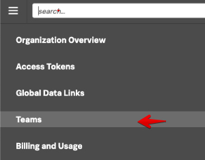
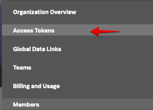

## Lab Summary

*  How to keep track of the usage of SignalFx in your organization.
*  Learn how to keep track of spend by exploring the Billing and Usage interface.
*  Create a team and add members to team
*  Discover how you can restrict usage for teams by creating separate access token's and set limits.

---

### 1. Let's see what has been created!

1. To see who is registered and what is being build inside your organization, right click on the *settings* icon on the top right of the SignalFx UI,

   (It may also look like this  ).
   From the drop down, select the **Organizations Settings → Organization Overview** tab, this will provide 
   you with the following dashboard that shows you how your SignalFx organization is being used:
   

2. On the right, you will see a list of registered users (blurred in the above screenshot), and the various 
   charts that show you the number of registered users, chart's and dashboards created and growth trends,
   The screenshot is taken from an actual organization, the workshop organization  your are looking at,
   may have less data to work with.
   Take a minute to explore the various charts in the Organization over view of the workshop instance.

***

## Step 2: Let's see what we've spend!
1. If you want to see what your spend is against your contract you can either select the  *settings* icon 
   on the top right of the SignalFx UI again,

   but this time select the **Organizations Settings → Usage and Billing** tab, or the faster way, 
   select the **Usage and Billing** tab from the left pane!

   Given this will recalculate the usage across your organization you may see a spinning 
    
***

2. You should see a screen similar like the one below  that will give you an overview of the current usage, 
   the average usage  and your entitlement per category : Nodes, Containers, Customer Metrics and 
   High Resolution Metrics.  
   For more information on what these are please read [ Billing and Usage information](https://docs.signalfx.com/en/latest/admin-guide/usage.html#viewing-billing-and-usage-information)
 

3. You can find the category count inside the 4 red boxes below the graphs and your entitlement 
   per catagory is shown in red above each graph. 
   The graph will also show you how much you are consuming at this point in time.
   
   In the bottom chart, you can see the usage per category for the current period (shown in the 
   drop-down box on the top right of the chart.) 
   The blue line marked _Average usage_ indicates what SignalFx will use to calculate your average usage 
   for the current period. 

   **Note:** As you can see from the screenshot, SignalFx does not use High water mark or p95% for 
   cost calculation but the actual average usage, allowing you do performance testing 
   or Blue/Green style deployments etc. etc. without risk of overage charges.  

   The Red box on the right  shows you information about your organizations and entitlement duration.
   
4.  You can change the category type by the drop down on the top left of the chart.
    Please take a minute to explore the different time periods & categories and their usage.

***

### 3. Let's see our teamwork!
1. To make sure that users directly see the dasboards and alerts that are relevant to them when they login to SignalFX, 
   most organizations will use SignalFx's Teams mechanisme to assign a user to a Team.
   Usually this matches work related roles, for example, members of a Dev-ops or Product Management group whould be assigned 
   to the corresponding Teams in SignalFx.

   Once an Team member is connected to SignalFx, they will be shown the Teams landing page, simular to the one shown below, 
   In this case for the Poduct Management team.
   Here, members see all the Dashboard, alerts that are assigned the team and  any other useful information so they
   can focus on what is relevant to their job.

   
   

   The above landing page has three Dashboard groups assigned, shows there is a critical alert that had this team as an adressee and some text and urls with other topics of interest. 

   ***
   
2. To work with  to signalFx's Team UI click on the settings  ) icon on the right top of the page and
   select the **Organizations Settings → Teams** tab, or select the **Teams** tab from the left pane.
    

   When the **Team** UI is selected you will be presented in the workshop with an empty Team's list 
  
  

***  
3. To add a new **Team** click on the green  button. This will present youy with the **Create New Team** Dialog.

   Create your own team by naming it [YOUR-INITIALS]-Team and add yourself by searching for your name and 
   selecting  the **Add** link behind your name. This should result in a dialog simular to the one below:
   
   You can remove selected users by pressing  **remove** or the small **x** behind a name.
   Make sure you have your group created with your initials and with yourself added as a member, then press done.

***   

4. This will bring you back to the **Teams** list that now show your Team and the one's created by others.
   Note that the group(s) you are a member of has a gray **Member** icon in front of it.
   If no members are assigned to your group, you should see a blue **Add members** link instead of the member count, 
   clicking on that link  will get you to the **Edit Team** dialog where you can add yourself.   
   This is the same dialog you get when pressing the 3 dots **...**   at the end of the Line with your team
   and select **Edit Team**.

   The 3 **...** menu give you the option to Edit a Team, Join or leave a Team or Delete a team.
   
   ***

4. You can set up specific Notification rules per team, click on the **NOTIFICATION POLICY** Button, 
   this will open the notification edit menu.

   By default the system offers you the ability to set up a general notification rule for your team.
   Note the Email all members, This mean all memebers n theis team will recieve an email with the Alert information, regrdless of the alert type.
   You can add other recipients, by  clicking 

   You can add a different email adresses to inform people outside SignalFx like _alerts@your-company.com_  for example or send an alert to an other team, like sending an alert on the Database of your application to the Database team along to you team.
    
   However if you click on the link **Configure separate notification tiers for different severity alerts**  You can configure every alert level differently.

  
   As you can see, You can set up different alert rules for the different alert level.
   In the screen shot below above you see that there have differn rules set up for all the Error levels,
   Here you see how wyou whold use send an alert to Splunk's VictorOps that will handle alertin the on call engineer and/or manager.
   For the Minor aleert we send it to the Teams slack channel and warning and info messages are send by email

   Below you see some of the Notification aoptions you can install in your SignalFx Organization:

***

## Step 4: Let's control a teams usage!
1. Managing tokens

