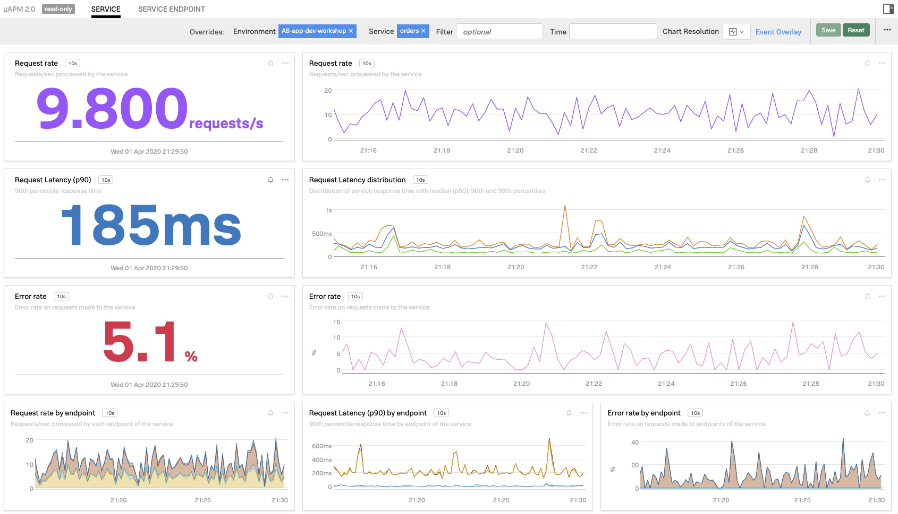
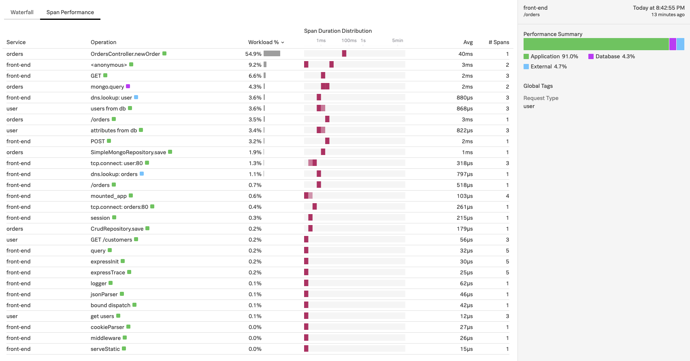

## Enabling µAPM
_An organisation needs to be pre-provisioned as a µAPM entitlement is required for the purposes of this module. Please contact someone from SignalFx to get a trial instance with µAPM enabled if you don’t have one already._

_To check if you have an organisation with µAPM enabled, just login to SignalFx and check that you have the µAPM tab on the top navbar next to Dashboards._

---

### 1. Create an instance running Kubernetes
This is already documented in [Deploying the SmartAgent in Kubernetes using K3s](https://signalfx.github.io/app-dev-workshop/module1/k3s/). 

### 2. Deploy the Sock Shop application into K3s

To deploy the Sock Shop application into K3s apply the deployment

```bash tab="Input"
cd apm/sockshop
kubectl create ns sock-shop
kubectl apply -f k8s/complete-demo.yaml
```


```text tab="Output"
namespace/sock-shop created
deployment.apps/carts-db created
service/carts-db created
deployment.apps/carts created
service/carts created
deployment.apps/catalogue-db created
service/catalogue-db created
deployment.apps/catalogue created
service/catalogue created
deployment.apps/front-end created
service/front-end created
deployment.apps/orders-db created
service/orders-db created
deployment.apps/orders created
service/orders created
deployment.apps/payment created
service/payment created
deployment.apps/queue-master created
service/queue-master created
deployment.apps/rabbitmq created
service/rabbitmq created
deployment.apps/shipping created
service/shipping created
deployment.apps/user-db created
service/user-db created
deployment.apps/user created
service/user created
```

### 3. Take Sock Shop for a test drive

Sock Shop should be running in your cluster and exposes services via cluster IP and port. Obtain the ip address for the front-end service.

```bash
SOCKS_ENDPOINT=$(kubectl get svc front-end -n sock-shop -o jsonpath='{.spec.clusterIP}:{.spec.ports[0].port}')
```

Then send a 

```bash tab="Input"
curl $SOCKS_ENDPOINT
```

```html tab="Output"
...
</script>
</body>

</html>
```

### 4. Apply load on Sock Shop

Use a load test for sock shop.

```bash
kubectl run --generator=run-pod/v1 load-test --rm -i --tty --image weaveworksdemos/load-test -- -d 5 -h $SOCKS_ENDPOINT -c 15 -r 1000
```

The parameter `-c` controls the amount of concurrent clients and `-r` the amount of requests sent. To apply continuous load just set `-r` to some higher number.

### 5. Visualize and analyze trace data

Navigate to µAPM (*not* µAPM PG) and select Monitoring, then ensure you have selected your environment from the dropdown at the top, you should see something like this:


Explore the User Interface: Review an automatically generated Service Dashboard. How do you correlate Service performance with Infrastructure?




Troubleshoot a service. Let's stress the sock shop a bit. Increase the amount of clients running for the load test to something ludicrous (1000+ seems to do the trick). What happens with the services? Troubleshoot a service with a higher error rate. Also review the service dependencies.


Look at individual traces and span performance.



