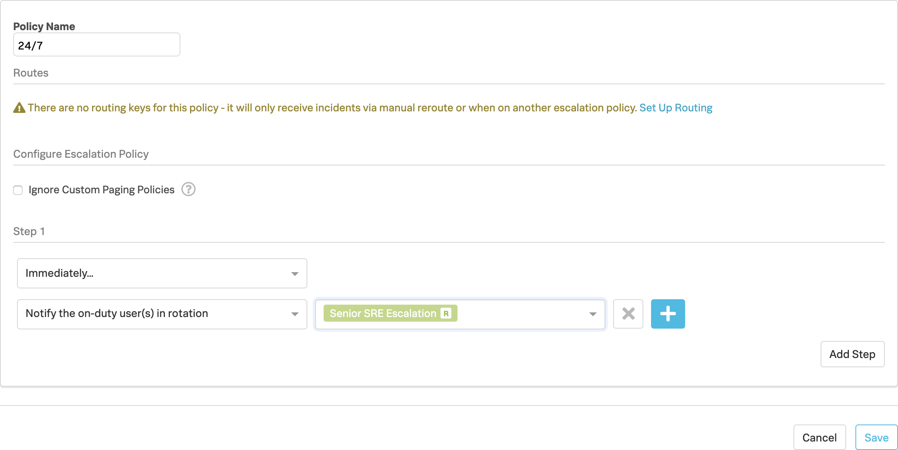
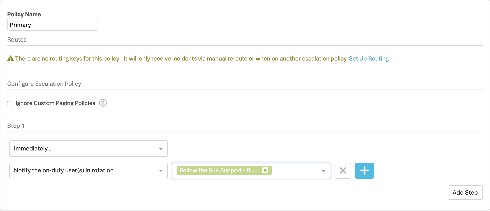
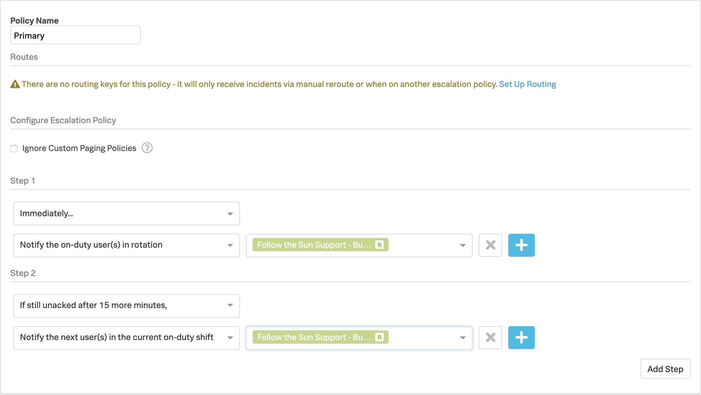
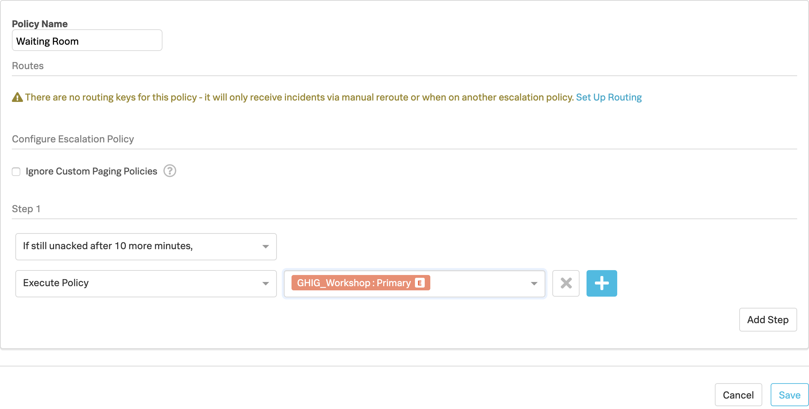

# Configure Escalation Policies

## Aim

Escalation policies determine who is actually on-call for a given team and are the link to utilizing any rotations that have been created.

The aim of this module is for you to create three different Escalation Policies to demonstrate a number of different features and operating models.

The instructor will start by explaining the concepts before you proceed with the configuration.

---

Navigate to the Escalation Polices tab on the Teams sub menu, you should have no existing Polices so we need to create some.

{: .center}

We are going to create the following Polices to cover off three typical use cases.

{: .zoom}

## 1. 24/7 Policy

Click **Add Escalation Policy**

* Policy Name: 24/7
* Step 1
* Immediately
  * Notify the on-duty user(s) in rotation → Senior SRE Escalation
  * Click **Save**

{: .zoom}

## 2. Primary Policy

Click **Add Escalation Policy**

* Policy Name: Primary
* Step 1
* Immediately
* Notify the on-duty user(s) in rotation → Follow the Sun Support - Business Hours
* Click **Add Step**

{: .zoom}

* Step 2
* If still unacked after 15 minutes
* Notify the next user(s) in the current on-duty shift → Follow the Sun Support - Business Hours
* Click **Add Step**

{: .zoom}

* Step 3
* If still unacked after 15 more minutes
* Execute Policy → [Your Team Name] : 24/7
* Click **Save**

{: .zoom}

## 3. Waiting Room Policy

Click **Add Escalation Policy**

* Policy Name: Waiting Room
* Step 1
* If still unacked after 10 more minutes
* Execute Policy → [Your Team Name] : Primary
* Click **Save**

{: .zoom}

You should now have the following three escalation polices:

{: .zoom}

You may have noticed that when we created each policy there was the following warning message:

!!! warning
    There are no routing keys for this policy - it will only receive incidents via manual reroute or when on another escalation policy

This is because there are no Routing Keys linked to these Escalation Polices, so now that we have these polices configured we can create the Routing Keys and link them to our Polices..

---
Continue and also complete the [Creating Routing Keys](../routing/) module.
