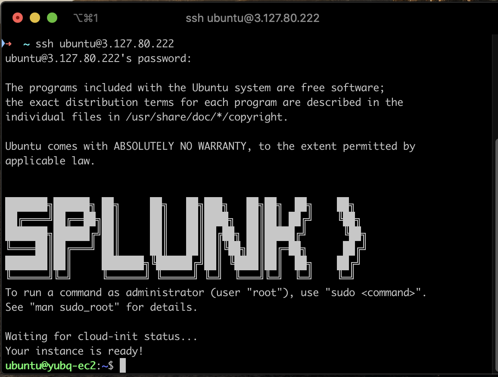
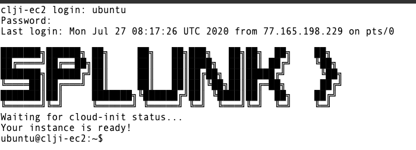
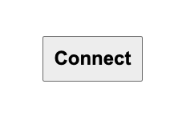

# How to connect to your workshop environment

1. How to retrieve the IP address of the AWS/EC2 instance assigned to you.
2. Connect to your instance using SSH, Putty[^1] or your web browser.
3. Verify Your connection to your AWS/EC2 cloud instance.

---

## 1. How to retrieve the IP address of the AWS/EC2 instance assigned to you

In preparation for the workshop, SignalFx has prepared an Ubuntu Linux instance in AWS/EC2.

To get access to the instance that you will be using in the workshop please visit the URL provided by the workshop leader.

Search for your AWS/EC2 instance by entering your first name as provided during registration for this workshop.

{: .zoom}

The search result will provide you with the IP address, the SSH command and the password to use to connect to the workshop instance.

!!! important
    Please make a note of the IP address as you will need this during the workshop.

## 2. Connect to your instance using SSH

Most attendees will be able to connect to the workshop by using SSH from their Mac or Linux device.

To use SSH, open a terminal on your system and type `ssh ubuntu@x.x.x.x` (replacing x.x.x.x with the IP address found in Step #1. In the example above this is `ssh ubuntu@3.127.80.222`)

{: .zoom}

When prompted **Are you sure you want to continue connecting (yes/no/[fingerprint])?** please type **yes**

{: .zoom}

When prompted to enter a password please use the once provided in the spreadsheet in Step #1.

Upon successful login you will be represented with the Splunk logo and Linux prompt.

{: .zoom}

At this point you are ready to continue and [start the workshop](https://signalfx.github.io/observability-workshop/latest/smartagent/k3s/)

---

## 3. Connect to your instance using Putty (Windows users only)

---

## 4. Connect to your instance using your web browser

If you are restricted and you cannot instal an ssh application like putty on your system,  you may be able to connect to the workshop instance by using a browser.   This assumes that access to port 6501 is nor restricted by your companies fire wall.

Open you favorite modern browser and type HTTP//X.X.X.X:6501  (where X.X.X.X is the ip address you found in section 1.)

{: .zoom}

Once you have connected correctly  you should receive an login in prompt similar like the screen below.

{: .zoom}

To connect please enter the user name **ubuntu** followed by the password found in section 1.
This should result in the welcome page of the workshop as show below:

{: .zoom}

Due to additional security requirements of browser technology please read the next section:

---

## 5. Use of copy and paste when connected via a browser

Unlike whe you are using regular ssh,  copy and page as is used during the workshop does require a few extra steps to complete when using a browser to connect.

!!! Note
    The reason for this is that regular paste option  cannot accept data from outside the browser, due to cross browser restrictions)

When the workshop ask you to type or copy some instructions please do the following:

*Copy the instruction as normal, but when  ready to paste it in the web terminal, choose **Paste from browser**  as show below:*

{: .zoom}

This will open a dialog box asking for the text to be pasted into the web terminal:

{: .zoom}

Paste the text in the text box as show, then press **OK** to complete the copy and paste process.

Unlike regular ssh connection, the web browser has a 60 second time out, and  you will be disconnected, and a **Connect** button will be show in the center of the web terminal.
Simply hit the connect button and you will be reconnected and you will be able to continue

 {: .zoom}

At this point you are ready to continue and [start the workshop](https://signalfx.github.io/observability-workshop/latest/smartagent/k3s/)

[^1]: [Download Putty](https://www.chiark.greenend.org.uk/~sgtatham/putty/)
