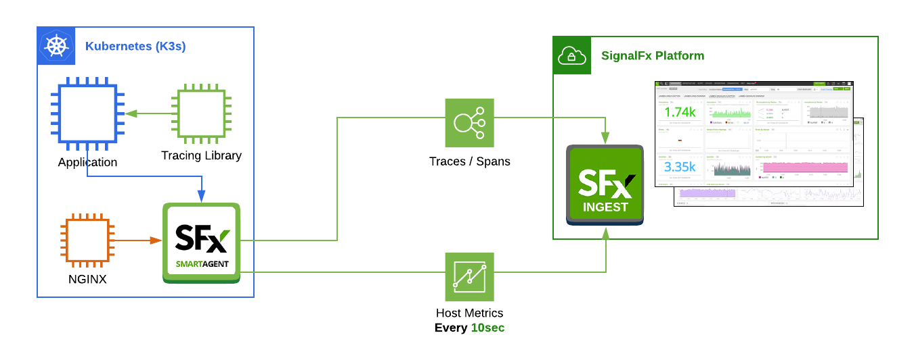

# Introduction

During this _**technical**_ workshop you will build out an environment based on a [lightweight](https://k3s.io/){: target=_blank} Kubernetes[^1] deployment.

In order to simplify the workshop modules, a pre-configured AWS/EC2 instance is provided.

The instance is pre-configured with all the software required to install the Smart Agent in Kubernetes, deploy a NGINX[^2] ReplicaSet[^3] and finally deploy a microservices application which has been instrumented to send Traces and Spans using Jaeger[^4].

The workshop also introduces you to dashboards, editing and creating charts, creating detectors to fire alerts, Monitoring as Code[^5] and the Service Bureau[^5]

{: .zoom}

By the end of this technical workshop you will have a good understanding of some of the key features and capabilities of the Observability Suite.

Here are the instructions how to access you pre-configured [AWS/EC2 instance](../smartagent/connect-info/)

[^1]: [Kubernetes](https://kubernetes.io/docs/concepts/overview/what-is-kubernetes/) is a portable, extensible, open-source platform for managing containerized workloads and services, that facilitates both declarative configuration and automation.
[^2]: NGINX is a web server that can also be used as a reverse proxy, load balancer, mail proxy and HTTP cache.
[^3]: [Kubernetes ReplicaSet](https://kubernetes.io/docs/concepts/workloads/controllers/replicaset/){: target=_blank}
[^4]: Jaeger, inspired by Dapper and OpenZipkin, is a distributed tracing system released as open source by Uber Technologies. It is used for monitoring and troubleshooting microservices-based distributed systems
[^5]: [Monitoring as Code and Service Bureau](https://www.splunk.com/en_us/blog/it/monitoring-observability-enterprise-service.html){: target=_blank}
