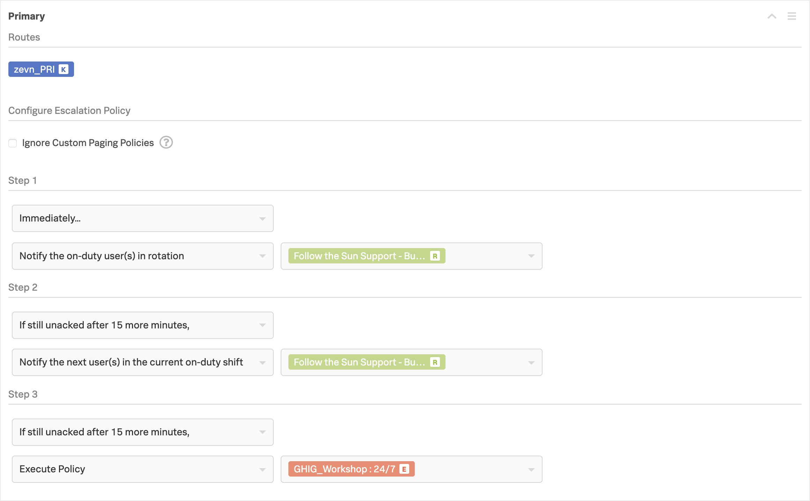

# Create Routing Keys

Routing Keys map the incoming alert messages from your monitoring system to an Escalation Policy which in turn sends the notifications to the appropriate team.

## 1. Instance ID

When you created your VM you generated a random Instance ID, and we will used this same ID when creating your Routing Key.  To get your Instance ID, return to the 1st command shell where you created your VM and run the following command:

=== "Input"

    ```bash
    echo $INSTANCE
    ```

=== "Example Output"

    ```text
    vmpe
    ```

!!! Tip "Closed session"
    If you have inadvertently closed the session down, open a new session and run `multipass list` to show the name of your VM, the 1st 4 letters are the values we are looking for.

Make a note of this 4 character string or copy to your clipboard.

## 2 Create Routing Keys

Navigate to **Settings** on the main menu bar, you should now be at the **Routing Keys** page.

You are going to create the following two Routing Keys using the naming conventions listed in the following table, but replacing {==INSTANCE==} with the 4 characters from above and replace {==TEAM_NAME==} with the team you were allocated or created earlier.

| Routing Key | Escalation Policies |
| --- | --- |
| {==INSTANCE==}_PRI | {==TEAM_NAME==} : Primary |
| {==INSTANCE==}_WR | {==TEAM_NAME==} : Waiting Room |

There will probably already be a number of Routing Keys configured, but to add a new one simply scroll to the bottom of the page and then click **Add Key**

In the left hand box, enter the name for the key as per the table above.  In the **Routing Key** column, select your Teams **Primary** policy from the drop down in the **Escalation Polices** column.  You can start typing your Team Name to filter the results.

{: .zoom}

!!! note
    If there are a large number of participants on the workshop, resulting in an unusually large number of Escalation Policies sometimes the search filter does not list all the Policies under your Team Name.  If this happens instead of using the search feature, simply scroll down to your team name, all the policies will then be listed.

Repeat the above steps for both Keys, xxx_PRI and xxx_WR, mapping them to your Teams Primary and Waiting Room policies.

!!! note
    You can assign a Routing Key to multiple Escalation Policies if required by simply selecting more from the list

If you now navigate back to **Teams → [Your Team Name] → Escalation Policies** and look at the settings for your **Primary** and **Waiting Room** polices you will see that these now have **Routes** assigned to them.

{: .zoom}

The **24/7** policy does not have a Route assigned as this will only be triggered via an **Execute Policy** escalation from the **Primary** policy.

---

This completes the initial getting started steps for VictorOps, the next step will be to configure the Integration between VictorOps and SignalFx.
