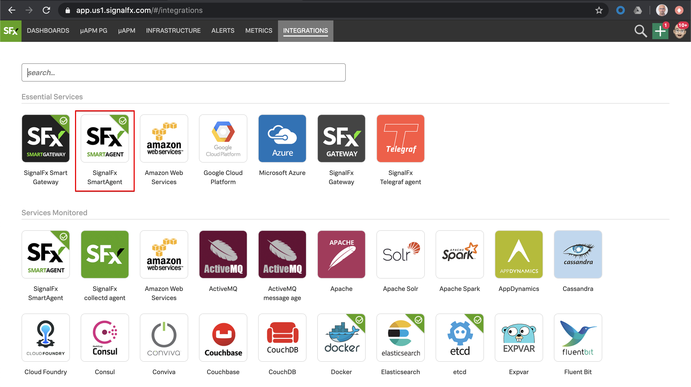
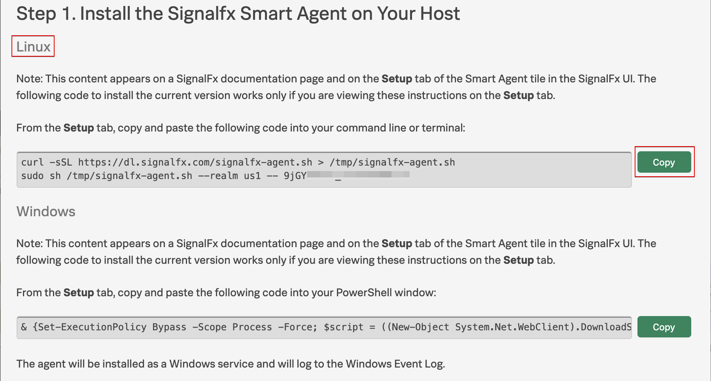
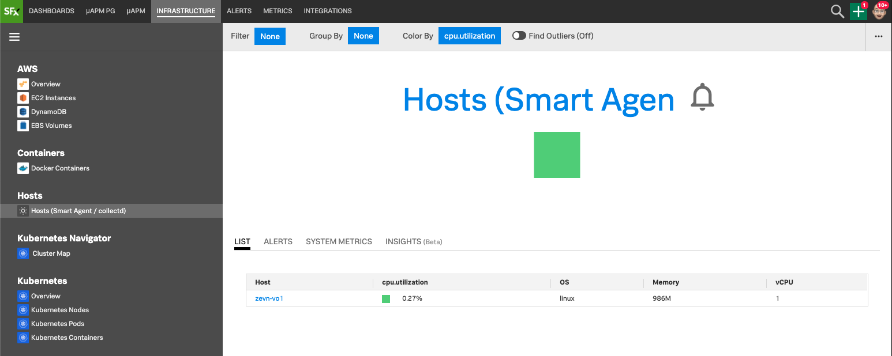

# Creating a Test Environment

1. Install Multipass
2. Create VM using Multipass
3. Install SignalFx UI
4. Check SignalFx Agent

---

## 1. Install Multipass

The easiest way to test VictorOps is to use Multipass to create a local test VM which will be monitored by SignalFx.

If you do not already have Multipass installed as per the pre-joining instructions you can download the installer from [here](https://multipass.run/).

MacOS users can install it using [Homebrew](https://brew.sh/) by running:

=== "Code"

    ```bash
    brew cask install multipass
    ```

---

## 2. Create VM using Multipass

### 2.1 Cloud-init

The first step is to pull down the `cloud-init` file to launch a pre-configured VM.

=== "Input"

    ```bash
    curl -s https://raw.githubusercontent.com/signalfx/observability-workshop/master/cloud-init/victorops.yaml -o victorops.yaml
    ```

### 2.2 Launch VM

Remaining in the same directory where you downloaded the `victorops.yaml`, run the following commands to create your VM.

The first command will generate a random unique 4 character string. This will prevent clashes in the SignalFx UI.

!!! note "Free up resources"
    You may also want to first shutdown any other VMs you have running to free up resources.

Create the VM:

=== "Input"

    ``` bash
    export INSTANCE=$(cat /dev/urandom | base64 | tr -dc 'a-z' | head -c4)
    multipass launch \
    --name ${INSTANCE}-vo1 \
    --cloud-init victorops.yaml
    ```

=== "Example Output"

    ``` bash
    Launched: vpme-vo1
    ```

Whilst your VM is being created you can proceed with the next step...

---

## 3. Install SignalFx Agent

An easy way to install the SignalFx Agent into your VM is to copy the install commands from the SignalFx UI, then run them directly within your VM.

### 3.1 SignalFx UI

Navigate to the SignalFx UI, open [this link](https://app.us1.signalfx.com/#/integrations) in a new tab/window, it will take you straight to the **INTEGRATIONS** tab, where we will find the SignalFx SmartAgent tile on the top row.

Click on the SmartAgent tile to open it...

{: .zoom}

...then select the **Setup** tab...

{: .zoom}

...then scroll down to 'Step 1' where you will find the commands for installing the agent. Keep this tab/window open as you will come back here in a couple of minutes to copy the commands.

{: .zoom}

### 3.2 Connect to VM

Now switch back to you local shell session and confirm the VM has finished deploying.  

=== "Shell Result"

    ``` bash
    Launched: vpme-vo1
    ```

Once the VM has deployed successfully, in a **new** shell session connect to the VM using the following command, replacing {==xxxx==} with the name of your VM.

=== "Shell Command"

    ``` bash
    multipass shell {==xxxx==}-vo1
    ```

=== "Example Input"

    ``` bash
    multipass shell vpme-vo1
    ```

=== "Example Output"

    ``` bash
    Last login: Tue Jun  9 15:10:19 2020 from 192.168.64.1
    ubuntu@vpme-vo1:~$
    ```

### 3.3 Install Agent

Now copy the linux install commands from the new tab/window you left open with the SignalFx UI and paste them into the VM shell session that you just created.

=== "Example Input"

    ``` bash
    curl -sSL https://dl.signalfx.com/signalfx-agent.sh > /tmp/signalfx-agent.sh
    sudo sh /tmp/signalfx-agent.sh --realm us1 -- xxxxyyyyzzzzz
    ```

=== "Example Output"

    ```bash
    The SignalFx Agent has been successfully installed.

    Make sure that your system's time is relatively accurate or else datapoints may not be accepted.

    The agent's main configuration file is located at /etc/signalfx/agent.yaml.
    ```

---

## 4. Check SignalFx Agent

### 4.1 Agent Status

Once the agent has completed installing run the following command to check the status

=== "Code"

    ```bash
    sudo signalfx-agent status
    ```

=== "Example Output"

    ```bash
    SignalFx Agent version:           5.3.0
    Agent uptime:                     2m7s
    Observers active:                 host
    Active Monitors:                  9
    Configured Monitors:              9
    Discovered Endpoint Count:        6
    Bad Monitor Config:               None
    Global Dimensions:                {host: zevn-vo1}
    GlobalSpanTags:                   map[]
    Datapoints sent (last minute):    237
    Datapoints failed (last minute):  0
    Datapoints overwritten (total):   0
    Events Sent (last minute):        18
    Trace Spans Sent (last minute):   0
    Trace Spans overwritten (total):  0

    Additional status commands:

    signalfx-agent status config - show resolved config in use by agent
    signalfx-agent status endpoints - show discovered endpoints
    signalfx-agent status monitors - show active monitors
    signalfx-agent status all - show everything
    ```
### 4.2 Check the SignalFx UI

Navigate to the SignalFx UI, [this link](https://app.us1.signalfx.com/#/navigator/EPNXccRAwAA/collectd%20hosts?colorBy=collectd.cpu.utilization&outlierStrategy=off)  will take you straight to the **INFRASTRUCTURE** tab, find your VM and confirm it is reporting in correctly; allow a few minutes for it to appear.

{: .zoom}

If it fails to appear after 3 mins, please let the Splunk Team know so they can help trouble shoot
