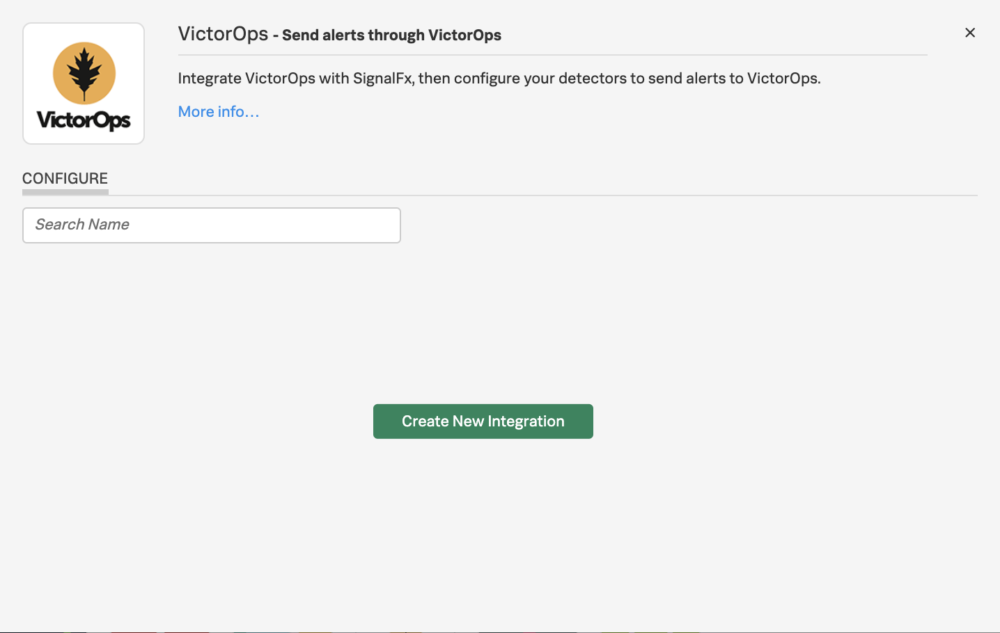
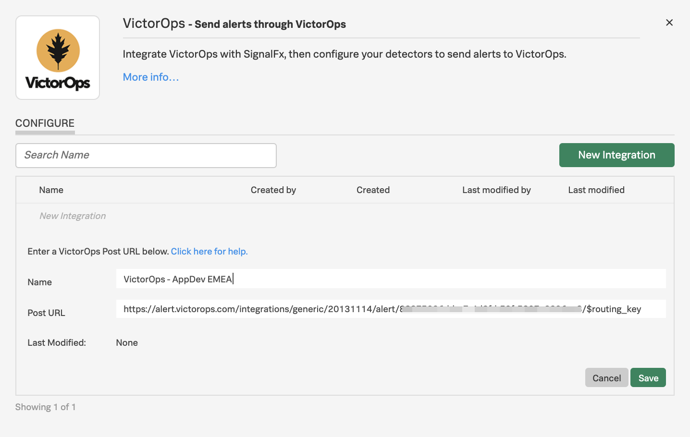

# VictorOps Integrations - Lab Summary

1. Configuring the Integration between VictorOps and SignalFx

---

## VictorOps Service API Endpoint

!!! warning
    The SignalFx Integration only needs to be enabled once per VictorOps instance, so you will probably find it has already been enabled, please **DO NOT** disable an already active integration when completing this lab.

In order to integrate SignalFx with VictorOps we need to first obtain the Service API Endpoint for VictorOps. Within the VictorOps UI navigate to **Integrations** main tab and then use the search feature to find the SignalFx Integration.

If it is not already enabled, click the Enable Integration button to activate it.

You simply need to copy the Service API Endpoint, including the `$routing_key` into your `values.txt` using the `Service_API_Endpoint` parameter.

{: .zoom}

This will be used when configuring the VictorOps Integration within the SignalFx UI.

## Enable VictorOps Integration within SignalFx

Login to your SignalFx account and navigate to **INTEGRATIONS** and use the search feature to find the VictorOps integration.

!!! danger "Do not create a new integration!"
    Please do not create additional VictorOps integrations if one already exists, it will not break anything but simply creates extra clean up work after the workshop has completed.  The aim of this part of the lab was to show you how you would go about configuring the Integration if it was not already enabled.

Assuming you are using the AppDev EMEA instance of VictorOps you will find the VictorOps Integration has already been configured so there is no need to create a new one.

However the process of creating a new Integration is simply to click on `Create New Integration` like in the image below, or if there are existing integrations and you want to add another one you would click `New Integration`.

Enter a descriptive `Name` then paste the `Service_API_Endpoint` value you copied in the previous step into the `Post URL` field, then save it.

!!! important "Handling multiple VictorOps integrations"
    SignalFx can integrate with multiple VictorOps accounts so it is important when creating one to use a descriptive name and to not simply call it VictorOps.  This name will be used within the SignalFx UI when selecting this integration, so ensure it is unambiguous

Once saved you need to copy the ID and save it in your `values.txt` using the `SFXVOPSID` parameter for use later in the module.

